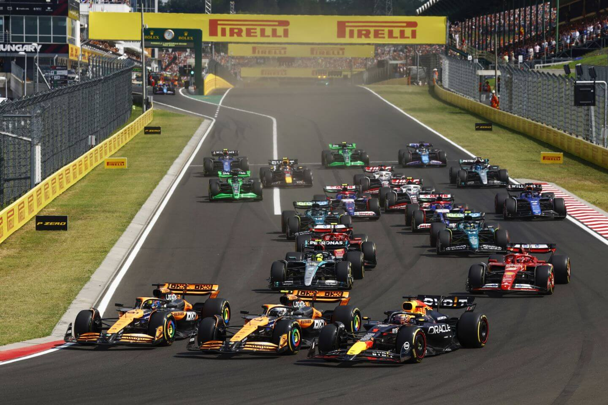
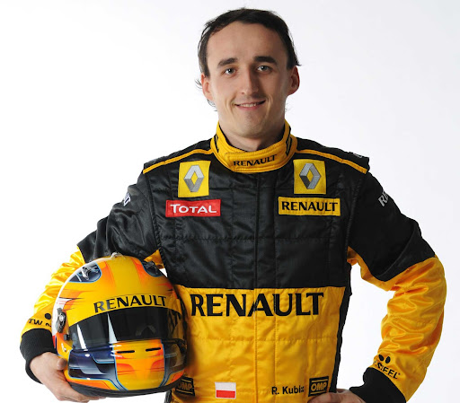
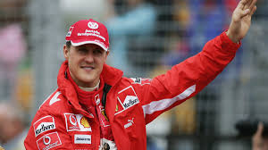

```{r}
#| include: false
#Potrzebne paczki
library(tidyverse)
library(ggplot2)
library(plotly)
library(purrr)
library(gt)
```

# Wprowadzenie



## Formuła 1 jako ekosystem danych

**Formuła 1 (F1)** to międzynarodowa seria wyścigów samochodowych rozgrywana od 1950 roku, uznawana za najwyższą klasę motorsportu, w której startują najlepsi kierowcy świata. Sezony F1 składają się z szeregu wyścigów Grand Prix, odbywających się na torach w różnych krajach i charakteryzujących się odmiennymi warunkami, od układów technicznych po pogodę. W każdym wyścigu kierowcy zdobywają punkty, które sumują się do klasyfikacji generalnej zarówno kierowców, jak i zespołów.

Współczesne bolidy są wyposażone w setki czujników, które rejestrują każdy parametr samochodu i toru – od temperatury hamulców, przez przeciążenia G, po zużycie opon. Dane te przesyłane są w czasie rzeczywistym do inżynierów w garażu oraz do fabryk zespołów, którzy wykorzystują je zarówno podczas wyścigu, aby optymalnie ustawić parametry auta pod konkretny tor i podejmować decyzje strategiczne, jak i później, do rozwoju samochodu. Analizy w fabryce często wykorzystują symulatory i wirtualne modele, które wymagają ogromnych ilości danych, pozwalając testować różne scenariusze i poprawiać wydajność bolidu. Formuła 1 działa więc jak ogromny ekosystem danych, w którym człowiek, technologia i analiza danych współtworzą ostateczny wynik wyścigu.

## Cel projektu

Celem niniejszego projektu jest eksploracyjna analiza danych historycznych Formuły 1 w celu zrozumienia czynników determinujących wyniki kierowców, przyczyn nieukończenia wyścigów oraz oceny efektywności poszczególnych zawodników. Analiza koncentruje się na:

-   identyfikacji sportowych, technicznych i strategicznych czynników wpływających na wyniki wyścigów,

-   zrozumieniu głównych przyczyn DNF i ich wpływu na punktację kierowców oraz niezawodność techniczną zespołów,

-   statystycznym określeniu, którzy kierowcy osiągali największą efektywność w historii F1, z uwzględnieniem liczby startów, zdobyczy punktowych i przewagi sprzętowej zespołów.

Projekt wykorzystuje metody statystyczne i wizualizacje danych, aby przekształcić surowe informacje sportowe w czytelne wnioski analityczne, pozwalające na porównania między kierowcami i zespołami oraz ocenę trendów historycznych.

## Pytania badawcze

**Pytanie 1**. Jakie czynniki determinują wynik kierowcy w wyścigu Formuły 1? <br>**Hipoteza 1:** Wynik końcowy kierowcy jest zależny od jednoczesnego wpływu czynników sportowych, technicznych i strategicznych.

**Pytanie 2**. Jakie są główne przyczyny nieukończenia wyścigów (DNF) w Formule 1 i w jaki sposób wpływają one na punktację kierowców oraz niezawodność techniczną zespołów w sezonie? <br>**Hipoteza 2:** Najczęstsze przyczyny DNF — w tym awarie techniczne, incydenty wyścigowe i błędy kierowców — prowadzą do obniżenia dorobku punktowego kierowców oraz ujawniają istotne różnice w niezawodności technicznej poszczególnych zespołów.

**Pytanie 3.** Czy można statystycznie określić, który kierowca jest najbardziej efektywny w historii Formuły 1?<br>**Hipoteza 3:** Najwyższą efektywność osiągają kierowcy charakteryzujący się najwyższym stosunkiem zdobyczy punktowych, zwycięstw i miejsc na podium do liczby startów, po uwzględnieniu przewagi sprzętowej zespołów.

# Opis danych

## Źródło danych

Analizowany zbiór danych pochodzi z serwisu Kaggle i został utworzony na podstawie API Ergast, które było aktywne do 2024 roku. Dane mają charakter oryginalny i wielotematyczny, obejmując różne aspekty sportu motorowego. Baza danych składa się z 14 tabel i zawiera łącznie 701 429 obserwacji. Zbiór jest stosunkowo złożony ze względu na:

-   różnorodność jednostek i formatów danych,

-   konieczność tworzenia relacji między tabelami poprzez łączenia,

-   brakujące wartości w niektórych kolumnach,

-   powtarzalność niektórych cech w wielu tabelach.

## Struktura danych

Dane obejmują informacje zarówno o wyścigach, jak i uczestnikach oraz zespołach:

-   Wyścigi: sezon, numer i nazwa Grand Prix, tor, data wyścigu, liczba okrążeń.

-   Kierowcy: imię, nazwisko, narodowość, zespół, liczba startów.

-   Wyniki: pozycja na mecie, zdobyte punkty, status ukończenia (Finish/DNF).

-   Dane techniczne i strategiczne: przyczyna DNF (awaria techniczna, wypadek, błąd kierowcy), informacje o zespole i sprzęcie.

## Przygotowanie danych

```{r}
#| include: false
#WCZYTASNIE DANYCH
circuits <- read.csv("dane/circuits.csv")
constructor_results <- read.csv("dane/constructor_results.csv")
constructor_standings <- read.csv("dane/constructor_standings.csv")
constructors <- read.csv("dane/constructors.csv")
driver_standings <- read.csv("dane/driver_standings.csv")
drivers <- read.csv("dane/drivers.csv")
lap_times <- read.csv("dane/lap_times.csv")
pit_stops <- read.csv("dane/pit_stops.csv")
qualifying <- read.csv("dane/qualifying.csv")
races <- read.csv("dane/races.csv")
results <- read.csv("dane/results.csv")
sprint_results <- read.csv("dane/sprint_results.csv")
status <- read.csv("dane/status.csv")


#CZYSZCZENIE
#Mam puste kolumny bez NULL albo \N jak jest wpisaywany brak w innych kolumnach spowodowane jest to tym że kierowcy nie wykrecili żandego czasu w tej części kwalifikacji, dzieje sie to w q2 i q3 dlatego powspisjmy \N aby ujednolicić zapis

qualifying$q2[qualifying$q2== ""] <- "\\N"
qualifying$q3[qualifying$q3== ""] <- "\\N"

#Uporządkowanie nazw zespołów aby te nie były podzielone na różne dzwine podzepoły typu Mclaren-Mercedes bo to nadal był Mclaren tylko dostawcą silnika isponosrem był Mercedes ale nadal tytuły itd liczą się do Mclarena

constructors <- constructors %>%
  mutate(
    manufacturer = case_match(
      # --- wyjątki wymagające ręcznej korekty ---
      name,
      "BMW Sauber"      ~ "BMW",
      "Lotus F1"        ~ "Lotus",
      "Team Lotus"      ~ "Lotus",
      "Lotus Racing"    ~ "Lotus",
      "Manor Marussia"  ~ "Manor",
      "Spyker MF1"      ~ "Spyker",
      "Behra-Porsche"   ~ "Behra-Porsche",
      "Tec-Mec"         ~ "Tec-Mec",
      "Talbot-Lago"     ~ "Talbot-Lago",
      "Arzani-Volpini"  ~ "Arzani-Volpini",
      # --- standardowe przypadki X-SILNIK ---
      .default = str_trim(str_extract(name, "^[^-]+"))
    )
  )

#USUWAMY NIE POTRZEBNE LUB PUSTE KOLUMNY
circuits <- circuits%>%
  select(-url)

constructors <- constructors%>%
  select(-url)

drivers <- drivers %>%
  select(-url)

races <- races %>%
  select(-fp1_date, -fp1_time,
         -fp2_date, -fp2_time,
         -fp3_date, -fp3_time,
         -quali_date, -quali_time,
         -sprint_date, -sprint_time, -url)

#SPRAWDZAMY TYPY DANYCH 

fix_nas_globally <- function(df) {
  df[df == "\\N"] <- NA
  return(df)
}

# Zastosowanie do wszystkich wczytanych ramek
# (Można to zrobić pętlą, ale dla przejrzystości wypisuję kluczowe)
results             <- fix_nas_globally(results)
qualifying          <- fix_nas_globally(qualifying)
pit_stops           <- fix_nas_globally(pit_stops)
constructor_results <- fix_nas_globally(constructor_results)
drivers             <- fix_nas_globally(drivers)

pit_stops$duration <- as.numeric(pit_stops$duration)

results <- results %>%
  mutate(
    milliseconds    = as.numeric(milliseconds),
    fastestLapSpeed = as.numeric(fastestLapSpeed),
    rank            = as.integer(rank),
    fastestLap      = as.integer(fastestLap)
  )

drivers$dob <- as.Date(drivers$dob)
races$date  <- as.Date(races$date)


sprint_results$milliseconds <- as.numeric(sprint_results$milliseconds)
sprint_results$fastestLap <- as.integer(sprint_results$fastestLap)

time_to_ms <- function(x) {
  sapply(x, function(t) {
    if (is.na(t)) return(NA_real_)
    p <- unlist(strsplit(t, "[:.]"))
    as.numeric(p[1]) * 60000 +
      as.numeric(p[2]) * 1000 +
      as.numeric(p[3])
  })
}

qualifying$q1_ms <- time_to_ms(qualifying$q1)
qualifying$q2_ms <- time_to_ms(qualifying$q2)
qualifying$q3_ms <- time_to_ms(qualifying$q3)
results$fastestLapTime_ms <- time_to_ms(results$fastestLapTime)
sprint_results$fastestLapTime_ms <- time_to_ms(sprint_results$fastestLapTime)


drivers$number <- as.integer(drivers$number)
qualifying$number <- as.integer(qualifying$number)
results$number <- as.integer(results$number)

results$position <- as.integer(results$position)
sprint_results$position <- as.integer(sprint_results$position)

str(circuits)
str(constructor_results)
str(constructor_standings)
str(constructors)
str(driver_standings)
str(drivers)
str(lap_times)
str(pit_stops)
str(qualifying)
str(races)
str(results)
str(sprint_results)
str(status)


#ŁĄCZYMY DANE Z TABEL
# Przygotowanie races: zmiana nazw i formatów
races <- races %>%
  rename(race_name = name, 
         race_date = date, 
         time_race_start = time)

# Przygotowanie drivers: zmiana nazw
drivers <- drivers %>%
  rename(personal_number = number, 
         driver_nationality = nationality)

# Przygotowanie constructors: zmiana nazw
constructors <- constructors %>%
  rename(team_name = name, 
         team_nationality = nationality)

# Przygotowanie circuits: zmiana nazw
circuits <- circuits %>%
  rename(circuit_name = name)


# 1. Pełne wyniki wyścigów
a_full_results <- results %>%
  left_join(status, by = "statusId") %>%
  left_join(races, by = "raceId") %>%
  left_join(drivers, by = "driverId") %>%
  left_join(constructors, by = "constructorId") %>%
  left_join(circuits, by = "circuitId")%>%
  select(
    forename,
    surname,
    code,
    personal_number,
    driver_nationality,
    team_name,
    team_nationality,
    manufacturer,
    grid,
    position,
    positionText,
    positionOrder,
    points,
    laps,
    time,
    milliseconds,
    fastestLap,
    rank,
    fastestLapTime,
    fastestLapTime_ms,
    fastestLapSpeed,
    status,
    year,
    round,
    race_name,
    race_date,
    circuit_name,
    location,
    country,
    raceId,
    driverId
  )

# 2. Czasy okrążeń (Uwaga: to będzie duża tabela)
a_full_lap_times <- lap_times %>%
  left_join(races, by = "raceId") %>%
  left_join(drivers, by = "driverId") %>%
  select(
    forename,
    surname,
    code,
    personal_number,
    driver_nationality,
    lap,
    position,
    time,
    milliseconds,
    year,
    round,
    race_name,
    race_date,
    raceId,
    driverId
  )

# 3. Wyniki konstruktorów
a_full_constructor_results <- constructor_results %>%
  left_join(races, by = "raceId") %>%
  left_join(constructors, by = "constructorId") %>%
  
  select(
    team_name,
    manufacturer,
    team_nationality,
    points,
    race_name,
    race_date,
    year,
    round,
    status,
    raceId,
    constructorId
  )

# 4. Klasyfikacja konstruktorów
a_full_constructor_standings <- constructor_standings %>%
  left_join(races, by = "raceId") %>%
  left_join(constructors, by = "constructorId") %>%
  select(
    team_name,
    manufacturer,
    team_nationality,
    points,
    wins,
    year,
    round,
    race_name,
    race_date,
    position,
    positionText,
    raceId,
    constructorId
  )


# 5. Kwalifikacje
a_full_qualifying <- qualifying %>%
  left_join(races, by = "raceId") %>%
  left_join(drivers, by = "driverId") %>%
  left_join(constructors, by = "constructorId") %>%
  left_join(circuits, by = "circuitId")%>%
  select(
    forename,
    surname,
    code,
    personal_number,
    driver_nationality,
    team_name,
    team_nationality,
    manufacturer,
    position,
    q1,
    q2,
    q3,
    q1_ms,
    q2_ms,
    q3_ms,
    year,
    round,
    race_name,
    race_date,
    circuit_name,
    location,
    country,
    raceId,
    driverId
  )

# 6. Pit stopy
a_full_pit_stops <- pit_stops %>%
  left_join(races, by = "raceId") %>%
  left_join(drivers, by = "driverId")%>%
  select(
    forename,
    surname,
    code,
    personal_number,
    driver_nationality,
    stop,
    lap,
    time,
    duration,
    milliseconds,
    year,
    round,
    race_name,
    race_date,
    raceId,
    driverId
  )

# 7. Klasyfikacja kierowców
a_full_driver_standings <- driver_standings %>%
  left_join(races, by = "raceId") %>%
  left_join(drivers, by = "driverId") %>%
  left_join(circuits, by = "circuitId") %>%
  select(
    forename,
    surname,
    code,
    personal_number,
    driver_nationality,
    points,
    position,
    positionText,
    wins,
    year,
    round,
    race_name,
    race_date,
    circuit_name,
    location,
    country,
    raceId,
    driverId
  )

# 8. Sprinty
a_full_sprint_results <- sprint_results %>%
  left_join(status, by = "statusId") %>%
  left_join(races, by = "raceId") %>%
  left_join(drivers, by = "driverId") %>%
  left_join(constructors, by = "constructorId") %>%
  left_join(circuits, by = "circuitId")%>%
  select(
    forename,
    surname,
    code,
    personal_number,
    driver_nationality,
    team_name,
    team_nationality,
    manufacturer,
    grid,
    position,
    positionText,
    positionOrder,
    points,
    laps,
    time,
    milliseconds,
    fastestLap,
    fastestLapTime,
    fastestLapTime_ms,
    status,
    year,
    round,
    race_name,
    race_date,
    circuit_name,
    location,
    country,
    raceId,
    driverId
  )


#Uporządkuje sobie nazwy w RStudio
a_circuits <- circuits
a_constructors <- constructors
a_drivers <- drivers
a_races <- races

rm(circuits)  # usuwa stary obiekt
rm(constructors)  # usuwa stary obiekt
rm(drivers)  # usuwa stary obiekt
rm(races)  # usuwa stary obiekt
```

Główne działania w ramach czyszczenia:

1.  Ujednolicenie braków w sesjach kwalifikacyjnych

W miejscach, gdzie brakowało czasów lub wyników (NA), wstawiono wartość specjalną (\\N ub brak), aby zachować spójność struktury tabeli. Dotyczyło to głównie sezonów od 2021 w dół, gdzie nie wszystkie sesje były raportowane.

2.  Normalizacja nazw zespołów – kolumna manufacturer

Wprowadzono kolumnę manufacturer, która reprezentuje oficjalną nazwę konstruktora w danym sezonie. Wszystkie warianty nazw zawierające dostawcę silnika lub sponsora zostały sprowadzone do głównej marki zespołu (np. McLaren-Ford → McLaren). Wyjątki historyczne, które nie pasowały do schematu X-SILNIK, zostały ręcznie ujednolicone (np. BMW Sauber → BMW, Alfa Romeo Sauber → Alfa Romeo). Zespoły historycznie powiązane (np. Sauber i Alfa Romeo, Toro Rosso i AlphaTauri) nie zostały łączone, aby zachować spójność sezonową.

3.  Zmiana typów zmienych w tabelach

W wielu tabelach dokonano zmian typów danych w kolumnach, dostosowując je lepiej do charakteru przechowywanych informacji. Zmiany te mają na celu zwiększenie spójności danych, poprawę wydajności zapytań oraz ograniczenie ryzyka błędów wynikających z nieodpowiednich typów. Dodatkowo w wybranych tabelach dodano kolumny przechowujące informacje o czasie wyrażone w milisekundach. Wartości te zostały przeliczone z dotychczasowych kolumn tekstowych, które były bardziej czytelne dla użytkownika, jednak mniej efektywne z punktu widzenia przetwarzania danych. Pozwoliło to na łatwiejsze wykonywanie operacji czasowych, sortowanie oraz filtrowanie danych.

4.  Łączenie tabel

W tym etapie przeprowadzono łączenie wybranych tabel w kilka większych, spójnych struktur danych. Celem było uproszczenie odczytu informacji oraz ułatwienie analizy danych. Dzięki konsolidacji danych możliwe stało się szybsze tworzenie zestawień i wykresów oraz ograniczenie potrzeby wykonywania złożonych operacji łączenia podczas analizy. Takie podejście zwiększa czytelność danych i usprawnia dalszą pracę analityczną.

# Jakie czynniki determinują wynik kierowcy w wyścigu Formuły 1?

##### Hipoteza: Wynik końcowy kierowcy jest zależny od jednoczesnego wpływu czynników sportowych, technicznych i strategicznych.

## Sportowe

### Wynik w kwalifikacjach vs wynik w wyścigu

```{r}
#| echo: false
#| message: false
#| warning: false
start_vs_finish <- a_full_results %>%
  filter(grid > 0, !is.na(position)) %>%
  group_by(grid) %>%
  summarise(
    mean_finish = mean(position),
    sd_finish = sd(position),
    n = n(),
    .groups = "drop"
  ) %>%
  mutate(
    lower = mean_finish - sd_finish,
    upper = mean_finish + sd_finish
  ) #Dodanie granic błędu

plot_start_vs_finish <- ggplot(start_vs_finish, aes(x = grid, y = mean_finish)) +
  geom_ribbon(aes(ymin = lower, ymax = upper), fill = "steelblue", alpha = 0.2) +
  geom_line(color = "steelblue") +
  geom_point(aes(text = paste("Pozycja startowa:", grid, 
                              "<br>Średni wynik:", round(mean_finish, 2), 
                              "<br>Średnie odchylenie:", round(sd_finish, 2),
                              "<br>Liczba Obserwacji:", n)), 
             color = "steelblue") +
  scale_y_reverse() +
  theme_minimal() +
  labs(title = "Pozycja startowa vs Pozycja końcowa",
       x = "Pozycja startowa",
       y = "Średnia pozycja końcowa")

ggplotly(plot_start_vs_finish, tooltip = "text")
```

<br>Wykres obrazuje korelację między pozycją startową a końcową w wyścigu. Dane wskazują, że im lepsza pozycja startowa, tym większa szansa na korzystny wynik, przy czym start z miejsc 1–15 daje najwyższe prawdopodobieństwo ukończenia zawodów w punktowanej dziesiątce (Top 10). Wraz z oddalaniem się pozycji startowej rośnie odchylenie standardowe, co wskazuje na zwiększoną nieprzewidywalność i losowość wyników w dalszej części stawki.

### Wpływ typu toru na wynik

```{r}
#| echo: false
#| message: false
#| warning: false
#Grupujemy tory - uzupełnamy dane
# Lista torów ulicznych / mieszanych (Street)
street <- c(
  "Albert Park Grand Prix Circuit",
  "Circuit de Monaco",
  "Valencia Street Circuit",
  "Marina Bay Street Circuit",
  "Las Vegas Strip Street Circuit",
  "Adelaide Street Circuit",
  "Phoenix street circuit",
  "Detroit Street Circuit",
  "Long Beach",
  "Las Vegas Street Circuit",
  "Montjuïc",
  "Circuito da Boavista",
  "Ain Diab",
  "Circuit de Pedralbes",
  "Baku City Circuit",
  "Jeddah Corniche Circuit",
  "Miami International Autodrome",
  "Watkins Glen International",
  "Charade Circuit",
  "Rouen-Les-Essarts",
  "Reims-Gueux",
  "Aintree",
  "AVUS",
  "Monsanto Park Circuit",
  "Pescara Circuit",
  "Circuit Bremgarten",
  "Sochi Autodrom"
)

# Tworzymy nowy dataframe z kolumną typ
a_circuits <- a_circuits %>%
  mutate(
    typ = ifelse(circuit_name %in% street, "Street", "Permanent")
  )
# Dane pod wykres
typ_full_results <- a_full_results %>%
  left_join(select(a_circuits, circuit_name, typ), by = "circuit_name") %>%
  mutate(driver_name = paste(forename, surname))

typ_driver_list <- typ_full_results %>%
  filter(position %in% 1:3) %>%
  count(driver_name, sort = TRUE) %>%
  slice_head(n = 20) %>%
  pull(driver_name)

typ_vs_wynik <- typ_full_results %>%
  filter(driver_name %in% typ_driver_list, !is.na(typ), !is.na(position))

NAZWA_GUZIKA <- "Włącz/Wyłącz punkty"
kolory_torow <- c("Street" = "#E15759", "Permanent" = "steelblue") 

# Wykres
typ_vs_wynik <- ggplot(typ_vs_wynik, aes(x = typ, y = position)) +
  geom_boxplot(aes(fill = typ), alpha = 0.7, outlier.shape = NA, width = 0.6) +
  geom_jitter(aes(text = paste0("<b>", driver_name, "</b>",
                                "<br>GP: ", circuit_name, 
                                "<br>Rok: ", year, 
                                "<br>Poz: ", position),
                  color = NAZWA_GUZIKA), 
              width = 0.15, height = 0, alpha = 0.6, size = 1.8) +
  scale_y_reverse(breaks = seq(1, 20, 5)) +
  facet_wrap(~ reorder(driver_name, position, FUN = median), scales = "free_x", ncol = 4) + #wymuszamy 3 kolumny zamiast 5
  scale_fill_manual(values = kolory_torow) +
  scale_color_manual(values = setNames("black", NAZWA_GUZIKA)) +
  labs(title = "Kierowcy: Tory Uliczne vs Stałe",
       y = "Pozycja na mecie",
       x = NULL) +
  theme_minimal(base_size = 12) + 
  theme(
    plot.title = element_text(face = "bold", size = 16, hjust = 0.5),
    strip.text = element_text(face = "bold", size = 11),
    panel.grid.minor = element_blank(),
    panel.grid.major.x = element_blank(),
    legend.title = element_blank(),
    legend.position = "right"
  )

typ_vs_wynik_interactive <- ggplotly(typ_vs_wynik, tooltip = "text") %>%
  layout(
    legend = list(title = list(text = "")),
    height = 1000 
  )

znaleziono_pierwszy <- FALSE
for (i in seq_along(typ_vs_wynik_interactive$x$data)) {
  name <- typ_vs_wynik_interactive$x$data[[i]]$name
  
  if (!is.null(name) && grepl(NAZWA_GUZIKA, name)) {
    typ_vs_wynik_interactive$x$data[[i]]$legendgroup <- "grupa_punktow"
    typ_vs_wynik_interactive$x$data[[i]]$name <- NAZWA_GUZIKA
    if (!znaleziono_pierwszy) {
      typ_vs_wynik_interactive$x$data[[i]]$showlegend <- TRUE
      znaleziono_pierwszy <- TRUE
    } else {
      typ_vs_wynik_interactive$x$data[[i]]$showlegend <- FALSE
    }
  } else {
    typ_vs_wynik_interactive$x$data[[i]]$showlegend <- FALSE
  }
}

config(typ_vs_wynik_interactive, displayModeBar = FALSE)
```

<br>Wykres przedstawia medianę oraz rozkład miejsc zajmowanych przez kierowców na mecie, z podziałem na charakterystykę toru (stały vs. uliczny). Analiza danych wskazuje, że choć ogólna forma zawodników jest zazwyczaj zbliżona na obu typach obiektów, to w niektórych przypadkach widoczne są wyraźne specjalizacje. Możemy zaobserwować zjawisko, w którym pewni kierowcy, jak Ayrton Senna czy Niki Lauda, radzili sobie statystycznie lepiej na torach ulicznych. Z kolei u innych, takich jak Michael Schumacher czy Mika Häkkinen, występuje tendencja odwrotna – z wyraźną przewagą wyników na torach stałych.

::: callout-warning
### Ostrzeżenie

Należy zaznaczyć, że tory stałe stanowią większość w rocznym kalendarzu Formuły 1, co przekłada się na znacznie liczniejszą grupę obserwacji (punktów danych) w tej kategorii w porównaniu do torów ulicznych.
:::

## Kierowca i zespół

### Kierowca vs tor - ulubione tory poszczególnych kierowców

```{r}
#| echo: false
#| message: false
#| warning: false
fav_track_driver_rank <- a_full_results %>%
  group_by(driverId) %>%
  summarise(overall_mean_position = mean(position, na.rm = TRUE),
            .groups = "drop") %>%
  arrange(overall_mean_position)

fav_track <- a_full_results %>%
  group_by(driverId, circuit_name) %>%
  summarise(
    mean_position = mean(position, na.rm = TRUE),
    count = n(),
    .groups = "drop"
  ) %>%
  left_join(a_drivers %>% select(driverId, forename, surname), by = "driverId") %>%
  mutate(full_name = paste(forename, surname)) %>%
  mutate(driverId = factor(driverId, levels = fav_track_driver_rank$driverId))

fav_track <- ggplot(fav_track,
            aes(x = circuit_name,
                y = driverId,
                fill = mean_position,
                text = paste0("Kierowca: ", full_name,
                              "<br>Tor: ", circuit_name,
                              "<br>Śr. poz.: ", round(mean_position,1),
                              "<br>Startów: ", count))) +
  geom_tile() +
  scale_fill_gradient(low="#B5C7EB", high = "#0C2B4E", name = "Śr. poz.") +
  theme_minimal() +
  labs(title = "Średnia pozycja kierowcy",
       x = "Tor",
       y = "Kierowca") +
  theme(
    axis.text.x = element_blank(),
    axis.text.y = element_blank(),
    panel.grid = element_blank()
  )

ggplotly(fav_track, tooltip = "text")
```

<br>Gęsta mapa ciepła przedstawia średnią pozycję końcową kierowców (oś pionowa) w podziale na tory wyścigowe (oś pozioma). Długie, wypełnione wiersze wskazują na weteranów sportu, rywalizujących na wielu obiektach, co odzwierciedla ich długowieczność i zdolność adaptacji. Z kolei pionowe skupiska danych ujawniają tory–klasyki kalendarza, regularnie goszczące Grand Prix przez dekady. Dominacja przerywanych wzorów i wyraźna zmienność kolorów podkreślają trudność utrzymania równej, wysokiej formy na wszystkich typach torów. W obrębie pojedynczych wierszy widoczne są silne kontrasty: ci sami kierowcy osiągają znakomite wyniki na wybranych obiektach, jednocześnie wyraźnie tracąc na innych. Wzorzec ten wskazuje na istnienie torowych „twierdz” oraz specyficznych słabości, sugerując, że preferencje i dopasowanie stylu jazdy do charakterystyki obiektu są istotnym czynnikiem kształtującym wyniki w całej karierze.

### Rzeczywsity wynik vs oczekiwany

```{r}
#| echo: false
#| message: false
#| warning: false
# 1. KROK: Obliczamy siłę zespołu
team_yearly_strength <- a_full_results %>%
  filter(!is.na(position)) %>%
  group_by(year, team_name) %>%
  summarise(
    expected_team_position = mean(position, na.rm = TRUE),
    .groups = "drop"
  )

# 2. KROK: Liczymy Deltę dla każdego wyścigu (BEZ ZMIAN)
driver_races_delta <- a_full_results %>%
  filter(!is.na(position)) %>%
  left_join(team_yearly_strength, by = c("year", "team_name")) %>%
  mutate(
    performance_delta = expected_team_position - position
  )

# 3. KROK: Agregacja Z PODZIAŁEM NA ZESPOŁY
# Teraz grupujemy po kierowcy ORAZ po nazwie zespołu
driver_team_stats <- driver_races_delta %>%
  group_by(forename, surname, driver_nationality, team_name) %>%
  summarise(
    total_races_in_team = n(),
    avg_delta = mean(performance_delta, na.rm = TRUE),
    .groups = "drop"
  ) %>%
  # FILTR: Odrzucamy epizody (np. kierowca pojechał 2 wyścigi w zespole)
  # Ustawiamy min. 15 wyścigów w barwach danego zespołu, żeby wynik był rzetelny
  filter(total_races_in_team >= 15) %>%
  arrange(desc(avg_delta))

# 4. KROK: Wybór danych (Top 30 najlepszych kadencji + 10 najgorszych)
top_stints <- head(driver_team_stats, 30)
bottom_stints <- tail(driver_team_stats, 10)

# 5 wykres
plot_data <- bind_rows(top_stints, bottom_stints) %>%
  mutate(
    label_name = paste0(surname, " (", team_name, ")"),
    full_name = paste(forename, surname),
    
    tooltip_text = paste0(
      "<b>", full_name, "</b><br>",
      "Zespół: ", team_name, "<br>",
      "Średnia delta: ", round(avg_delta, 2), "<br>",
      "Liczba wyścigów w tym zespole: ", total_races_in_team
    )
  )

p <- ggplot(plot_data, aes(
  x = reorder(label_name, avg_delta), 
  y = avg_delta, 
  fill = avg_delta > 0,
  text = tooltip_text
)) +
  geom_col(alpha = 0.8) +
  coord_flip() +
  scale_fill_manual(values = c("TRUE" = "#00A08B", "FALSE" = "#E15759"),
                    name = "Wynik",
                    labels = c("Poniżej oczekiwań", "Powyżej oczekiwań")) +
  geom_hline(yintercept = 0, linetype = "dashed", color = "gray30") +
  labs(
    title = "Kto i w jakim zespole robił największą różnicę?",
    x = "",
    y = "Średnia zyskana pozycja względem bolidu"
  ) +
  theme_minimal() +
  theme(
    legend.position = "none",
    axis.text.y = element_text(size = 8)
  )

ggplotly(p, tooltip = "text")
```

<br>Wykres przedstawia zestawienie kierowców pod kątem ich indywidualnego wpływu na wyniki zespołu (pozytywnego lub negatywnego). Dane wyróżniają zawodników osiągających rezultaty znacząco powyżej potencjału bolidu, z wyraźną dominacją Fangio i Clarka. Na szczególną uwagę zasługuje jednak Fernando Alonso, który pojawia się w zestawieniu aż trzykrotnie (w barwach Ferrari, Aston Martina i Renault), za każdym razem wykazując dodatni wpływ na osiągi, co dowodzi jego niezwykłej regularności niezależnie od maszyny. Dolna część wykresu obrazuje natomiast kierowców, których rezultaty najbardziej odbiegały in minus od poziomu zespołu (m.in. Sato, Sargeant).

::: callout-note
### Ciekawostka

W ścisłej czołówce zestawienia (na wysokim 3. miejscu) znajduje się Robert Kubica w barwach Renault. Jego wynik statystycznie potwierdza opinię o wyjątkowej umiejętności Polaka do „wyciskania” z bolidu więcej, niż teoretycznie pozwalała na to jego specyfikacja techniczna, plasując go w towarzystwie największych legend tego sportu.
:::

{width="330"} {width="330"}

### Zespół vs wynik

```{r}
#| echo: false
#| message: false
#| warning: false
# Wybieramy np. TOP 50 producentów z największą liczbą wyścigów
top_manufacturers <- a_full_results %>%
  filter(!is.na(position)) %>%
  count(manufacturer) %>%
  top_n(50, n) %>%
  pull(manufacturer)

zespol_vs_wynik <- a_full_results %>%
  filter(manufacturer %in% top_manufacturers) %>%
  filter(!is.na(position))

zespol_vs_wynik <- ggplot(zespol_vs_wynik, aes(x = reorder(manufacturer, position, FUN = median), y = position)) +
  geom_boxplot(fill = "steelblue", alpha = 0.6, outlier.size = 0.4, outlier.alpha = 0.3) +
  scale_y_reverse(breaks = c(1, 5, 10, 15, 20, 25, 30, 35)) + 
  labs(
    title = "Ranking producentów F1",
    x = NULL, # Nazwy są czytelne, etykieta zbędna
    y = "Pozycja na mecie"
  ) +
  coord_flip() + # Poziomy układ - dużo łatwiej czytać nazwy
  theme_minimal() +
  theme(
    axis.text.y = element_text(size = 7, face = "bold"), # Wyraźne nazwy zespołów
    panel.grid.major.y = element_blank() # Czysto pod nazwami
  )


ggplotly(zespol_vs_wynik, tooltip = c("y", "fill", "x")) %>%
  style(marker = list(size = 3))
```

<br>Wykres prezentuje rozkład miejsc na mecie dla 50 konstruktorów z największą liczbą startów w historii F1. Układ graficzny wyraźnie odzwierciedla hierarchię sił: zespoły ulokowane po prawej stronie (Mercedes, Ferrari, Red Bull) regularnie zajmują czołowe lokaty, wykazując się przy tym najmniejszym rozrzutem wyników, co świadczy o ich ogromnej powtarzalności i niezawodności.

Analiza ujawnia również dużą amplitudę formy historycznych gigantów (takich jak Williams czy McLaren), których szeroki zakres wyników obrazuje zmienne losy tych marek na przestrzeni dekad – od okresów absolutnej dominacji po sezony walki o przetrwanie. Z kolei zespoły zamykające stawkę (np. HRT, Virgin) wykazują specyficzną „stabilność w słabości” – ich wyniki są powtarzalne, ale oscylują wyłącznie w dolnych rejonach tabeli. Warto również odnotować, że dla ścisłej czołówki (prawa strona wykresu) miejsca poza pierwszą dziesiątką są statystycznymi anomaliami (reprezentowanymi przez pojedyncze punkty), wynikającymi zazwyczaj z awarii lub incydentów torowych, a nie z braku tempa wyścigowego.

### Zespoły na przestrzeni lat - rozwój zepołów i wpływ na wyniki

::: callout-important
Błąd danych dla 2024. Wykres analizować w latach 1958-2023
:::

```{r}
#| echo: false
#| message: false
#| warning: false

# 1. DEFINICJA ER
eras <- data.frame(
  name = c("Silniki Środkowe", "Aero", "Przyziemny", 
           "Turbo", "Wolnossąca", "V10", "V8", 
           "KERS", "Hybrydowa V6 Turbo"),
  start = c(1958, 1968, 1978, 1983, 1989, 1997, 2006, 2009, 2014),
  end   = c(1967, 1977, 1982, 1988, 1996, 2005, 2008, 2013, 2024) 
) %>%
  mutate(
    midpoint = (start + end) / 2,
    fill_group = factor(row_number() %% 2)
  )

# 2. PRZYGOTOWANIE DANYCH
lineage_base <- a_full_constructor_standings %>%
  filter(year >= 1958) %>% # Wykres zaczyna się od 1958
  group_by(year) %>%
  filter(round == max(round)) %>%
  ungroup() %>%
  mutate(
    family_group = case_match(
      team_name,
      c("Tyrrell", "BAR", "Honda", "Brawn", "Mercedes") ~ "Mercedes-AMG",
      c("Stewart", "Jaguar", "Red Bull") ~ "Red Bull Racing",
      c("Toleman", "Benetton", "Renault", "Lotus F1", "Alpine") ~ "Alpine (Renault)",
      c("Jordan", "Midland", "Spyker", "Force India", "Racing Point", "Aston Martin") ~ "Aston Martin",
      c("Minardi", "Toro Rosso", "AlphaTauri", "RB F1 Team", "Racing Bulls") ~ "RB (Minardi)",
      c("Sauber", "BMW Sauber", "Alfa Romeo", "Kick Sauber") ~ "Sauber",
      "Ferrari" ~ "Ferrari", "McLaren" ~ "McLaren", "Williams" ~ "Williams", "Haas" ~ "Haas F1 Team",
      .default = NA_character_
    ),
    team_lineage = coalesce(family_group, team_name) 
  ) %>%
  filter(position <= 10)

# Budowa danych pod suwak
all_years <- sort(unique(lineage_base$year))
cumulative_data <- map_df(all_years, function(y) {
  lineage_base %>%
    filter(year <= y) %>%
    mutate(frame_year = y)
})

lineage_colors <- c(
  "Ferrari" = "#DC0000", "McLaren" = "#FF8700", "Williams" = "#005AFF",
  "Mercedes-AMG" = "#00D2BE", "Red Bull Racing" = "#0600EF",
  "Alpine (Renault)" = "#FFF500", "Aston Martin" = "#006F62",
  "RB (Minardi)" = "#2B4562", "Sauber" = "#9B0000", "Haas F1 Team" = "#B6BABD"
)

# 3. BUDOWA WYKRESU

p <- ggplot(cumulative_data, aes(x = year, y = position, group = team_lineage, color = team_lineage)) +
  
  # TŁO ER (Statyczne)
  geom_rect(data = eras, 
            aes(xmin = start, xmax = end, ymin = -Inf, ymax = Inf, fill = fill_group),
            alpha = 0.1, inherit.aes = FALSE) +
  scale_fill_manual(values = c("0" = "gray90", "1" = "white"), guide = "none") +
  
  # PIONOWE LINIE ODDZIELAJĄCE ERY (Statyczne)
  # Dodajemy linie na początku każdej ery oraz na samym końcu ostatniej
  geom_vline(xintercept = c(eras$start, max(eras$end)), 
             linetype = "dashed", color = "gray80", size = 0.4) +
  
  geom_text(data = eras,
            aes(x = midpoint, y = -1.5, label = name), 
            angle = 45, size = 2.8, color = "gray30", inherit.aes = FALSE, 
            fontface = "bold", vjust = 0, hjust = 0) +
  
  # LINIE I KROPKI (Mapowanie pod suwak)
  geom_line(aes(frame = frame_year), size = 0.7, alpha = 0.6) +
  geom_point(aes(frame = frame_year, 
                 text = paste("Rok:", year, "<br>Zespół:", team_name, "<br>Poz:", position)), 
             size = 1.8) +
  
  # ETYKIETA ZESPOŁU NA KOŃCU LINII
  geom_text(data = cumulative_data %>% group_by(frame_year, team_lineage) %>% filter(year == frame_year),
            aes(x = year, y = position, label = team_name, frame = frame_year),
            hjust = -0.15, vjust = 0.5, size = 3, fontface = "bold") +
  
  # USTAWIENIA OSI
  scale_y_reverse(breaks = 1:10, limits = c(10, -3.5)) + 
  scale_x_continuous(breaks = seq(1958, 2024, 5), limits = c(1958, 2027)) +
  scale_color_manual(values = lineage_colors) +
  
  theme_minimal() +
  labs(title = "Ewolucja Konstruktorów",
       x = "Rok", y = "Pozycja w Klasyfikacji") +
  theme(legend.position = "none",
        panel.grid.minor = element_blank(),
        plot.title = element_text(face = "bold", size = 14))
# ---------------------------------------------------------
# 4. KONFIGURACJA PLOTLY (SUWAK)
# ---------------------------------------------------------
fig <- ggplotly(p, tooltip = "text") %>%
  animation_opts(frame = 100, transition = 0, redraw = FALSE) %>%
  animation_slider(
    currentvalue = list(prefix = "Analizowany rok: ", font = list(color="steelblue", size=14))
  ) %>%
  config(displayModeBar = FALSE)

fig
```

<br>Wykres wizualizuje dynamiczną ewolucję układu sił w F1 (1958–2023), obrazując cykliczność sukcesu w tym sporcie. Okresy wyraźnej dominacji (np. Ferrari, McLarena, Mercedesa) są tu często przerywane przez zmiany regulaminowe – pionowe linie (np. era hybrydowa od 2014 r.) wyraźnie pokrywają się z punktami zwrotnymi, działając jak katalizator przetasowań w stawce. Mimo tej zmienności, dane kontrastują zespoły o chwilowych sukcesach z historycznymi potęgami, które wykazały się zdolnością adaptacji i przez większość czasu potrafiły utrzymać się w ścisłej czołówce.

## Strategia

### Liczba pit stopów vs wynik

```{r}
#| echo: false
#| message: false
#| warning: false
# 1. Agregacja: Upewniamy się, że grupujemy po WYŚCIGU i KIEROWCY
# Używamy max(stop), bo to numer sekwencyjny postoju (1, 2, 3...)
stops_count_data <- a_full_pit_stops %>%
  group_by(raceId, driverId) %>%
  summarise(stops_count = max(as.integer(stop), na.rm = TRUE), .groups = "drop") %>%
  # --- BEZPIECZNIK ---
  # Odrzucamy anomalie. Wszystko powyżej 10 to błąd danych lub dublowanie się wierszy.
  filter(stops_count <= 10) 

# 2. Łączenie z wynikami
pit_vs_result_final <- a_full_results %>%
  filter(!is.na(position)) %>%
  select(raceId, driverId, position, forename, surname, race_name, year) %>%
  inner_join(stops_count_data, by = c("raceId", "driverId")) %>%
  mutate(driver_full_name = paste(forename, surname))

# 3. Wykres z poprawionymi danymi (BEZ KROPEK)
plot_pit_vs_result <- ggplot(pit_vs_result_final, aes(x = factor(stops_count), y = position)) +
  # Rysujemy tylko boxplot
  geom_boxplot(fill = "steelblue", alpha = 0.6, outlier.shape = NA) +
  # Usunięto geom_jitter (warstwę punktów)
  scale_y_reverse(breaks = seq(1, 20, 2)) +
  labs(title = "Liczba Pit Stopów a Wynik",
       x = "Liczba Pit Stopów",
       y = "Pozycja na mecie") +
  theme_minimal()

# Wyświetlenie interaktywne (domyślny tooltip pokaże medianę, kwartyle itp.)
ggplotly(plot_pit_vs_result)
```

<br>Wykres analizuje wpływ strategii serwisowej na końcowy rezultat wyścigu (dane skorygowane). Widoczna jest wyraźna korelacja ujemna: im mniejsza liczba postojów, tym statystycznie wyższa pozycja na mecie. Strategie oszczędne (1–2 pit stopy) oferują najwyższą medianę wyników (okolice 8.–9. miejsca) i dają realną szansę na walkę o zwycięstwo (górny wąs wykresu sięga 1. miejsca). Z kolei duża liczba zjazdów (powyżej 4) drastycznie obniża szanse na sukces, spychając kierowców do drugiej dziesiątki.

::: callout-tip
Na liczbę pit-stopów istotny wpływ mają czynniki zewnętrzne, w szczególności zmienne warunki pogodowe. Deszczowe wyścigi często wymuszają serię nieplanowanych zjazdów po opony przejściowe lub deszczowe. Tłumaczy to duży rozrzut wyników przy strategiach 4+ pit stopów – w takich chaotycznych okolicznościach duża liczba postojów nie zawsze oznacza porażkę, a czasem jest elementem zwycięskiej taktyki.
:::

### Czas trwania pit-stopów vs wynik

```{r}
#| echo: false
#| message: false
#| warning: false

# 1. Łączenie danych o pit stopach z wynikami końcowymi
# Musimy wiedzieć, na którym miejscu dojechał kierowca wykonujący dany pit stop
pit_stop_analysis <- a_full_pit_stops %>%
  left_join(select(a_full_results, raceId, driverId, position), 
            by = c("raceId", "driverId")) %>%
  filter(!is.na(position), !is.na(milliseconds)) %>%
  # Konwersja na sekundy dla czytelności
  mutate(duration_sec = milliseconds / 1000) %>%
  # FILTRACJA: Usuwamy postoje naprawcze i bardzo długie (powyżej 50s)
  # aby skupić się na "wyścigowych" zmianach opon/paliwa
  filter(duration_sec < 50) 

# Dodatkowa kolumna tekstowa do tooltipa (interakcji)
pit_stop_analysis <- pit_stop_analysis %>%
  mutate(tooltip_text = paste0(
    "<b>", forename, " ", surname, "</b>",
    "<br>Czas: ", round(duration_sec, 3), " s",
    "<br>Okrążenie: ", lap,
    "<br>GP: ", race_name, " (", year, ")"
  ))


# 1. Agregacja danych (obliczamy średnią i odchylenie dla każdej pozycji)
pit_stop_stats <- pit_stop_analysis %>%
  group_by(position) %>%
  summarise(
    mean_time = mean(duration_sec, na.rm = TRUE),
    sd_time = sd(duration_sec, na.rm = TRUE),
    n_stops = n(),
    .groups = "drop"
  ) %>%
  # Obliczamy granice wstęgi (średnia +/- odchylenie)
  mutate(
    lower = mean_time - sd_time,
    upper = mean_time + sd_time
  )

# 2. Generowanie wykresu
plot_ribbon <- ggplot(pit_stop_stats, aes(x = position, y = mean_time)) +
  
  # Wstęga (szary cień) - pokazuje odchylenie standardowe
  geom_ribbon(aes(ymin = lower, ymax = upper), 
              fill = "steelblue", alpha = 0.2) +
  
  # Linia łącząca średnie
  geom_line(color = "steelblue", linewidth = 1) +
  
  # Punkty na linii (dla interakcji)
  geom_point(aes(text = paste0("Pozycja: ", position,
                               "<br>Średni czas: ", round(mean_time, 2), " s",
                               "<br>Odchylenie: +/- ", round(sd_time, 2), " s",
                               "<br>Liczba postojów: ", n_stops)),
             color = "steelblue", size = 2) +
  
  # Estetyka
  labs(
    title = "Średnia czasu vs Pozycja na mecie",
    x = "Pozycja na mecie",
    y = "Średni czas pit stopu (s)"
  ) +
  theme_minimal() +
  theme(
    plot.title = element_text(face = "bold", size = 14)
  )

# 3. Interaktywność
ggplotly(plot_ribbon, tooltip = "text") %>%
  layout(yaxis = list(title = "Średni Czas (s)"))
```

<br>Wykres ilustruje relację między średnim czasem pit stopu a zajętą pozycją na mecie, uwzględniając zmienność wyników. Na podstawie wizualizacji widoczny jest wyraźny trend wzrostowy, w którym czołowa piątka osiąga najkrótsze czasy (23,0–23,5 s), systematycznie wydłużające się wraz ze spadkiem pozycji. Dla pierwszej dziesiątki (miejsca 1-10) linia trendu pozostaje stosunkowo płaska i stabilna, wykazując jedynie minimalny wzrost. Potwierdza to, że w rywalizacji o punkty kluczowym czynnikiem jest powtarzalność procedur i brak błędów w alei serwisowej. Powyżej 20. miejsca widoczny jest duży rozrzut danych wynikający z małej liczby obserwacji

### Samochów bezpieczeństwa

::: callout-warning
### Ostrzeżenie

Dane dotyczące samochodu bezpieczeństwa zostały oszacowane na podstawie czasów przejazdu, przy założeniu redukcji tempa o ok. 40%. W związku z tym mogą występować minimalne rozbieżności względem wartości rzeczywistych.
:::


```{r}
#| message: false
#| warning: false
#| include: false
# --- DETEKCJA SAFETY CAR NA PODSTAWIE CZASÓW (ALGORYTM UŻYTKOWNIKA) ---

# 1. Przygotowanie danych z czasami okrążeń
# Grupujemy po wyścigu i numerze okrążenia, liczymy średni czas stawki
lap_trends <- a_full_lap_times %>%
  group_by(raceId) %>%
  mutate(
    race_median_time = median(milliseconds, na.rm = TRUE) # Bazowe tempo wyścigu
  ) %>%
  group_by(raceId, lap) %>%
  summarise(
    avg_lap_time = mean(milliseconds, na.rm = TRUE),
    race_median_time = first(race_median_time),
    .groups = "drop"
  ) %>%
  mutate(
    # --- TU JEST KLUCZ ---
    # Jeśli okrążenie jest o 40% wolniejsze od normy (mnożnik 1.4), uznajemy to za SC.
    # To wyłapie SC, VSC i ewentualnie ulewy (co też zmienia strategię).
    is_slow_lap = avg_lap_time > (race_median_time * 1.40)
  )

# 2. Sumujemy "powolne okrążenia" dla każdego wyścigu
sc_detected_stats <- lap_trends %>%
  group_by(raceId) %>%
  summarise(
    slow_laps_count = sum(is_slow_lap),
    .groups = "drop"
  ) %>%
  mutate(
    # Kategoryzacja dla wykresu
    chaos_category = case_when(
      slow_laps_count == 0 ~ "Czysty wyścig",
      slow_laps_count <= 4 ~ "Krótka neutralizacja",
      TRUE ~ "Dużo neutralizacji (Chaos)"
    )
  )

# 3. Łączymy z wynikami kierowców
# (Używamy stops_count_data z poprzednich kroków)
sc_time_analysis <- a_full_results %>%
  filter(!is.na(position), grid > 0) %>%
  select(raceId, driverId, position, grid, forename, surname, year) %>%
  inner_join(stops_count_data, by = c("raceId", "driverId")) %>%
  inner_join(sc_detected_stats, by = "raceId") %>%
  mutate(
    position_change = grid - position,
    full_name = paste(forename, surname)
  )
```

#### SC a zysk pozycji

```{r}
#| echo: false
#| message: false
#| warning: false
plot_sc_time_gain <- ggplot(sc_time_analysis, aes(x = factor(slow_laps_count), y = position_change)) +
  geom_boxplot(fill = "#FFC107", alpha = 0.6, outlier.shape = NA) +
  geom_hline(yintercept = 0, linetype = "dashed", color = "grey30") +
  # Ograniczamy oś X dla czytelności (powyżej 15 okrążeń SC to rzadkość/Spa 2021)
  scale_x_discrete(breaks = 0:15) + 
  labs(
    title = "Wpływ Neutralizacji na awanse",
    x = "Liczba okrążeń w tempie SC",
    y = "Zmiana pozycji (Start - Meta)"
  ) +
  theme_minimal()

ggplotly(plot_sc_time_gain)
```

<br>Wykres ilustruje zależność pomiędzy długością faz neutralizacji a zmianą pozycji na mecie, przy jednoczesnym uwzględnieniu zmienności wyników. Na podstawie wizualizacji widoczny jest wyraźny trend wskazujący, że najdłuższe okresy neutralizacji (powyżej 10 okrążeń) sprzyjają znaczącym awansom pozycyjnym, osiągając najwyższą medianę zysków pozycji.

Dla krótszych faz neutralizacji (0–9 okrążeń) rozkład zmian pozycji pozostaje szeroki i w dużej mierze symetryczny względem zera, z licznymi wartościami odstającymi, co wskazuje na wysoki poziom losowości wyników. Sugeruje to, że przy braku lub krótkotrwałych zakłóceniach o końcowym rezultacie w większym stopniu decydują czynniki przypadkowe oraz zdarzenia wyścigowe.

W przypadku bardzo długich neutralizacji (11–12 okrążeń) obserwowane jest natomiast wyraźne ograniczenie ryzyka znaczących spadków w klasyfikacji, co może wskazywać, że takie warunki premiują stabilność, zachowanie koncentracji oraz unikanie błędów.

#### Strategia postojów w obliczu Safety Cara

```{r}
#| echo: false
#| message: false
#| warning: false
interaction_time_data <- sc_time_analysis %>%
  filter(stops_count <= 4)

plot_sc_strategy <- ggplot(interaction_time_data, 
                           aes(x = factor(stops_count), y = position, fill = chaos_category)) +
  geom_boxplot(alpha = 0.7, outlier.shape = NA) +
  scale_fill_manual(values = c("Czysty wyścig" = "steelblue", 
                               "Krótka neutralizacja" = "#F28E2B",
                               "Dużo neutralizacji (Chaos)" = "#E15759")) +
  scale_y_reverse(breaks = seq(1, 20, 2)) +
  labs(
    title = "Opłacalność Pit Stopów a Neutralizacje",
    x = "Liczba Pit Stopów",
    y = "Pozycja na mecie",
    fill = "Warunki (wg czasów)"
  ) +
  theme_minimal() +
  theme(legend.position = "bottom")

ggplotly(plot_sc_strategy) %>%
  layout(boxmode = "group")
```

<br>Wykres przedstawia zależność pomiędzy liczbą pit stopów a ostateczną pozycją na mecie, z uwzględnieniem wpływu warunków neutralizacji na skuteczność strategii wyścigowej. Analiza wizualna wskazuje, że w warunkach „Chaosu” (duża liczba neutralizacji – kolor czerwony) kierowcy osiągają przeciętnie najlepsze wyniki końcowe, a strategia jednego pit stopu okazuje się w tych okolicznościach najbardziej opłacalna, osiągając medianę około 7. miejsca.

W przypadku „Czystego wyścigu” (brak lub niewielka liczba neutralizacji – kolor niebieski) strategia jednego postoju traci na efektywności, natomiast optymalnym kompromisem wydają się dwa zjazdy do alei serwisowej, które zapewniają bardziej stabilne rezultaty w środkowej części stawki.

Wyniki te potwierdzają, że obecność samochodu bezpieczeństwa premiuje oszczędne strategie pit stopów oraz pozwala ograniczyć straty czasowe wynikające z postojów. Jednocześnie większa liczba wizyt w alei serwisowej (3–4 pit stopy) w warunkach płynnej jazdy prowadzi do wyraźnego pogorszenia pozycji końcowej.

#### Analiza ryzyka i szans w warunkach chaosu

```{r}
#| echo: false
#| message: false
#| warning: false
plot_violin_chaos <- ggplot(sc_time_analysis, 
                            aes(x = factor(slow_laps_count), 
                                y = position_change, 
                                fill = factor(slow_laps_count))) +
  geom_violin(trim = FALSE, alpha = 0.4, color = NA) +
  geom_boxplot(width = 0.1, fill = "white", alpha = 0.8, outlier.shape = NA) +
  geom_hline(yintercept = 0, linetype = "dashed", color = "red", alpha = 0.5) +
  scale_x_discrete(breaks = 0:10) +
  scale_fill_viridis_d(option = "inferno", direction = -1, guide = "none") +
  labs(
    title = "Ile można zyskać dzięki neutralizacjom?",
    x = "Liczba okrążeń z SC w wyścigu",
    y = "Zmiana pozycji"
  ) +
  theme_minimal() +
  theme(panel.grid.minor = element_blank())

ggplotly(plot_violin_chaos, tooltip = NULL)

```

<br>Wykres przedstawia zależność pomiędzy łączną liczbą okrążeń przejechanych w tempie neutralizacji a potencjałem awansu w wyścigu, z uwzględnieniem rozkładu prawdopodobieństwa zmian pozycji. Analiza wskazuje, że przy znikomej lub umiarkowanej liczbie neutralizacji (0–6 okrążeń) rozkład wyników pozostaje szeroki i w przybliżeniu symetryczny względem zera, co świadczy o wysokiej losowości rywalizacji — obserwowane są zarówno znaczące awanse, jak i dotkliwe straty, czemu towarzyszy duża liczba wartości odstających.

Wraz ze wzrostem liczby wolnych okrążeń, szczególnie w przedziale 10–12, rozkłady zmian pozycji ulegają wyraźnemu przesunięciu w górę, przy jednoczesnym skróceniu dolnych ogonów. Zjawisko to potwierdza, że długotrwałe fazy neutralizacji, mimo zwiększonego poziomu chaosu, sprzyjają zyskiwaniu pozycji oraz ograniczają ryzyko głębokich spadków w klasyfikacji końcowej, premiując kierowców zdolnych do utrzymania koncentracji i unikania błędów w przerywanym przebiegu wyścigu.

#### Bilans zysków i strat

```{r}
#| echo: false
#| message: false
#| warning: false
# 1. Agregujemy dane do mapy
heatmap_strategy_data <- sc_time_analysis %>%
  filter(stops_count <= 4) %>% # Interesują nas normalne strategie 1-4 stopy
  group_by(stops_count, chaos_category) %>%
  summarise(
    avg_finish_pos = mean(position, na.rm = TRUE),
    count = n(),
    .groups = "drop"
  )

# 2. Rysujemy Mapę
plot_heatmap_strategy <- ggplot(heatmap_strategy_data, 
                                aes(x = factor(stops_count), y = chaos_category, fill = avg_finish_pos)) +
  geom_tile(color = "white", lwd = 1.5) + # Kafelki z białymi ramkami
  # Dodajemy tekst na kafelkach (średnia pozycja)
  geom_text(aes(label = round(avg_finish_pos, 1)), color = "white", fontface = "bold") +
  # Skala kolorów: Im niższa liczba (lepsza pozycja), tym bardziej "zielono/niebiesko"
  scale_fill_gradient(low = "#00A08B", high = "#B22222", name = "Śr. Pozycja") +
  labs(
    title = "Matryca Strategiczna",
    x = "Liczba Pit Stopów",
    y = "Warunki na torze (wg Twojego algorytmu)"
  ) +
  theme_minimal() +
  theme(
    panel.grid = element_blank(),
    axis.text = element_text(size = 11, face = "bold")
  )

ggplotly(plot_heatmap_strategy, tooltip = NULL)
```

<br>Matryca strategiczna obrazuje wpływ liczby pit stopów na średnią pozycję na mecie w zależności od zidentyfikowanych warunków panujących na torze. Na podstawie wizualizacji wyraźnie widać, że strategia jednego postoju jest optymalnym wyborem we wszystkich scenariuszach, zapewniając najwyższą skuteczność szczególnie w warunkach “Chaosu” (najlepsza średnia pozycja 7.3). Wraz ze wzrostem liczby wizyt w alei serwisowej wynik końcowy generalnie ulega pogorszeniu, jednak skala tego zjawiska zależy od przebiegu wyścigu. W “Czystym wyścigu” każdy kolejny pit stop liniowo i drastycznie obniża szanse na dobry wynik (spadek do średniej 11.3 przy 4 stopach), podczas gdy w warunkach dużej liczby neutralizacji wynik stabilizuje się na poziomie 8.8 niezależnie od tego, czy kierowca wykonał 2, 3 czy 4 postoje. Potwierdza to, że zamieszanie na torze skutecznie “amortyzuje” koszt dodatkowych zjazdów, podczas gdy płynna rywalizacja bezlitośnie karze za każdą nadmiarową stratę czasu.

# Jakie są główne przyczyny nieukończenia wyścigów (DNF) w Formule 1 i w jaki sposób wpływają one na punktację kierowców oraz niezawodność techniczną zespołów w sezonie?

##### Hipoteza: Najczęstsze przyczyny DNF — w tym awarie techniczne, incydenty wyścigowe i błędy kierowców — prowadzą do obniżenia dorobku punktowego kierowców oraz ujawniają istotne różnice w niezawodności technicznej poszczególnych zespołów.

## Przyczyny

### Przyczny DNF

```{r}
#| echo: false
#| message: false
#| warning: false
# Tabela 1: Szczegółowe przyczyny (tekstowe) - tylko dla DNF
dnf_clean <- a_full_results %>%
  filter(status != "Finished", !grepl("^\\+", status)) %>%
  mutate(
    category = case_when(
      grepl("Accident|Collision|Spun|Fatal|Damage|Debris", status, ignore.case = TRUE) ~ "Wypadek/Kolizja",
      grepl("Engine|Turbo|Power|ERS|Battery|Electric|Electron|Spark|Ignition|Hydraulics|Pump|Oil|Fuel|Water|Cooling|Radiator|Exhaust|Fire|Heat|Overheating|Throttle|Pressure|Misfire|Injector|Magneto|Supercharger|Alternator", status, ignore.case = TRUE) ~ "Silnik/Osprzęt",
      grepl("Gearbox|Clutch|Transmission|Differential|Driveshaft|Halfshaft|Axle|Joint|Bearing", status, ignore.case = TRUE) ~ "Skrzynia/Napęd",
      grepl("Suspension|Brake|Tyre|Puncture|Wheel|Rim|Steering|Wing|Undertray|Handling|Chassis|Nut|Aerodynamics", status, ignore.case = TRUE) ~ "Zawieszenie/Opony/Aero",
      grepl("Disqualified|Excluded|Rule|Underweight|Refuelling|Data", status, ignore.case = TRUE) ~ "Dyskwalifikacja/Regulamin",
      TRUE ~ "Inne/Nieznane"
    )
  )

# Tabela 2: Dane liczbowe (flagi 0/1) - dla wszystkich startów
# KORZYSTAMY Z TWOJEJ LISTY 'street' ZDEFINIOWANEJ WCZEŚNIEJ
data_dnf_flags <- a_full_results %>%
  mutate(
    is_dnf = ifelse(status != "Finished" & !grepl("^\\+", status), 1, 0),
    track_type = ifelse(circuit_name %in% street, "Uliczny", "Stały")
  )

# Spójna paleta kolorów
cols_cat <- c("Wypadek/Kolizja" = "#F28E2B", "Silnik/Osprzęt" = "#E15759", 
              "Skrzynia/Napęd" = "#76B7B2", "Zawieszenie/Opony/Aero" = "#59A14F",
              "Dyskwalifikacja/Regulamin" = "#EDC948", "Inne/Nieznane" = "#BAB0AC")


# Tabela (bez zmian)
top_causes <- dnf_clean %>% count(status, category, sort = TRUE) %>% slice_head(n = 20)

# Wykres z naprawionym tooltipem
p_a1 <- ggplot(top_causes, aes(
    x = reorder(status, n), 
    y = n, 
    fill = category,
    # TWORZYMY WŁASNĄ ETYKIETĘ DO DYMKA:
    text = paste0("<b>Przyczyna:</b> ", status, "<br>",
                  "<b>Liczba:</b> ", n, "<br>",
                  "<b>Kategoria:</b> ", category)
  )) +
  geom_col(alpha = 0.8) + 
  coord_flip() + 
  scale_fill_manual(values = cols_cat) +
  labs(title = "Top 20 przyczyn nieukończenia wyścigu", x = NULL, y = "Liczba") +
  theme_minimal() + 
  theme(legend.position = "none")

# WAZNE: argument tooltip = "text"
ggplotly(p_a1, tooltip = "text")
```

<br>Wykres przedstawia najczęstsze przyczyny nieukończenia wyścigu Formuły 1. Widoczne są zarówno dominujące kategorie, jak i kilka wyróżnionych przypadków szczególnych. Zdecydowanie najczęstszą przyczyną DNF są awarie silnika, które dotknęły łącznie ponad 2000 kierowców, co podkreśla skalę problemów z niezawodnością jednostek napędowych w historii F1. Na kolejnych pozycjach znajdują się błędy popełniane przez samych kierowców, prowadzące do odpadnięcia z wyścigu — przede wszystkim incydenty (np. uderzenia w bandę), kolizje z innymi zawodnikami oraz spiny. Relatywnie częstą przyczyną jest również niedopuszczenie do wyścigu na podstawie zasady 107%, zgodnie z którą czas kierowcy w kwalifikacjach nie może być gorszy niż 107% najlepszego czasu. Zjawisko to występowało najczęściej w latach 50.–90., kiedy różnice sprzętowe między zespołami były szczególnie duże. Warto także zwrócić uwagę na awarie skrzyni biegów, które — obok problemów z silnikiem — stanowią jedną z częstszych technicznych przyczyn nieukończenia wyścigu.

### Przyzczny na przestrzeni lat

```{r}
#| echo: false
#| message: false
#| warning: false
dnf_trend <- dnf_clean %>% group_by(year, category) %>% summarise(count = n(), .groups = "drop")
p_a2 <- ggplot(dnf_trend, aes(x = year, y = count, fill = category)) +
  geom_area(alpha = 0.8, color = "white", linewidth = 0.2) + scale_fill_manual(values = cols_cat) +
  labs(title = "Historia przyczyn DNF", x = "Sezon", y = "Liczba DNF") +
  theme_minimal()

ggplotly(p_a2, tooltip = NULL)
```

<br> Wykres obrazuje dynamiczne zmiany w strukturze przyczyn nieukończenia wyścigów Formuły 1 na przestrzeni ostatnich dekad. Historycznie, aż do okolic roku 2000, dominującym czynnikiem były awarie jednostek napędowych, co widoczne jest w ogromnym udziale kategorii silnikowej w XX wieku. W latach 80. i 90. uwagę zwraca również gwałtowny wzrost kategorii "Inne", obejmującej m.in. specyficzne dla tamtego okresu problemy z kwalifikacją do wyścigu. Od 1975 roku obserwujemy natomiast wyraźny wzrost znaczenia incydentów torowych. Choć liczba kolizji utrzymuje się na stabilnym, a ostatnio nawet nieco niższym poziomie, to w obliczu współczesnej, wysokiej niezawodności bolidów, właśnie błędy kierowców i wypadki stały się obecnie najczęstszą przyczyną DNF w nowoczesnej F1.

### Kierowca vs przyczyny

```{r}
#| echo: false
#| message: false
#| warning: false
# A3. Heatmapa Kierowców - Z POPRAWIONYMI POLSKIMI NAPISAMI
# Tabela (bez zmian)
top_dnf_drivers <- dnf_clean %>% count(driverId) %>% top_n(25, n) %>% pull(driverId)

heatmap_data <- dnf_clean %>% 
  filter(driverId %in% top_dnf_drivers, status %in% top_causes$status[1:10]) %>% 
  count(surname, status)

# Wykres z definicją polskiego dymka
p_a3 <- ggplot(heatmap_data, aes(
    x = status, 
    y = surname, 
    fill = n,
    # Definiujemy polski tekst do dymka:
    text = paste0("<b>Kierowca:</b> ", surname, "<br>",
                  "<b>Przyczyna:</b> ", status, "<br>",
                  "<b>Liczba awarii:</b> ", n)
  )) +
  geom_tile(color = "white") + 
  scale_fill_gradient(low = "#FFEBEE", high = "steelblue") +
  labs(title = "Co eliminowało kierowców?", x = NULL, y = NULL) +
  theme_minimal() + 
  theme(axis.text.x = element_text(angle = 45, hjust = 1))

# Wyświetlenie interaktywne z wymuszeniem własnego tekstu
ggplotly(p_a3, tooltip = "text")
```

<br>Heatmapa szczegółowo obrazuje przyczyny nieukończenia wyścigów przez 25 kierowców z największą liczbą DNF w historii Formuły 1. Na pierwszy plan wysuwa się dominująca, ciemnoniebieska pionowa linia w kolumnie Engine (silnik), wskazująca, że awarie jednostki napędowej były głównym powodem wycofań dla niemal wszystkich analizowanych zawodników — od mistrzów świata, takich jak Niki Lauda, Nelson Piquet czy Nigel Mansell, po kierowców środka stawki. Szczególnie wyraźne są przypadki Riccardo Patresego oraz Michele Alboreto, u których liczba defektów silnika jest wyjątkowo wysoka.

Drugim istotnym trendem są kategorie Accident i Collision. Choć dotyczą one każdego kierowcy, ich intensywność jest zróżnicowana — wyraźnie wyróżniają się tu m.in. Andrea de Cesaris, znany z agresywnego stylu jazdy, oraz Jean Alesi. Wykres ujawnia również specyfikę poszczególnych epok: kategoria Did not prequalify (brak prekwalifikacji) pozostaje pusta dla wielu legend sportu, lecz stanowi istotną przyczynę eliminacji w przypadku kierowców takich jak Piercarlo Ghinzani, co odzwierciedla brutalne realia rywalizacji w wyjątkowo licznych stawkach lat 80.

## Wpływ na punkty

### DNF vs punkty

```{r}
#| echo: false
#| message: false
#| warning: false
# Tabela (bez zmian)
driver_season_stats <- data_dnf_flags %>%
  group_by(year, driverId, forename, surname) %>%
  summarise(total_points = sum(points, na.rm = TRUE), 
            dnf_count = sum(is_dnf), 
            races_count = n(), 
            .groups = "drop") %>%
  mutate(dnf_category = ifelse(dnf_count == 0, "Bez DNF", "Z DNF"))

# B1. Scatter DNF vs Punkty - Z POPRAWIONYM DYMKIEM
p_b1 <- ggplot(driver_season_stats %>% filter(races_count >= 10), aes(
    x = dnf_count, 
    y = total_points,
    # Definicja treści dymka:
    text = paste0("<b>Liczba DNF:</b> ", dnf_count, "<br>",
                  "<b>Punkty:</b> ", total_points)
  )) +
  geom_point(alpha = 0.3, color = "steelblue") +
  # Ważne: geom_smooth nie dziedziczy 'text', więc będzie miał standardowy dymek, co jest OK
  geom_smooth(aes(text = NULL), method = "lm", color = "#D62728", fill = "#D62728", alpha = 0.2) +
  labs(title = "DNF vs Punkty w sezonie", x = "Liczba DNF", y = "Punkty") + 
  theme_minimal()

# Wymuszenie użycia zdefiniowanego tekstu w tooltipie
ggplotly(p_b1, tooltip = "text")
```

<br>Wykres punktowy analizuje fundamentalną zależność między liczbą nieukończonych wyścigów (DNF) a sumarycznym dorobkiem punktowym kierowcy w trakcie sezonu. Obserwujemy tu wyraźną, negatywną korelację, którą podkreśla opadająca czerwona linia trendu: wraz ze wzrostem liczby DNF, szanse na wysoki wynik punktowy drastycznie maleją. Warto zauważyć asymetrię tego zjawiska – przy wysokiej niezawodności (0–3 DNF) rozrzut wyników jest ogromny, sięgający od zera do ponad 400 punktów, co sugeruje, że samo dojeżdżanie do mety jest warunkiem koniecznym, ale niewystarczającym do sukcesu (potrzebne jest jeszcze tempo). Natomiast w strefie wysokiej awaryjności (powyżej 8–10 DNF) "sufit" punktowy gwałtownie się obniża, spłaszczając wyniki niemal do zera, co w praktyce uniemożliwia jakąkolwiek walkę o czołowe lokaty, niezależnie od potencjału kierowcy czy bolidu.

### Kierowcy z duża ilościa DNF vs z małą ilością

```{r}
#| echo: false
#| message: false
#| warning: false
# B2. Boxplot Sezony czyste vs z DNF
p_b2 <- ggplot(driver_season_stats %>% filter(races_count >= 10), aes(x = dnf_category, y = total_points, fill = dnf_category)) +
  geom_boxplot(alpha = 0.7) + scale_fill_manual(values = c("Bez DNF" = "steelblue", "Z DNF" = "#E15759")) +
  labs(title = "Wpływ czystego sezonu na punkty", x = NULL, y = "Punkty") + theme_minimal() + theme(legend.position = "none")

ggplotly(p_b2)
```

<br>Wykres porównuje dorobek punktowy kierowców, którzy ukończyli wszystkie wyścigi w sezonie („Bez DNF”), z tymi, którzy zanotowali co najmniej jedno nieukończenie. Widoczna jest bardzo duża dysproporcja wyników: mediana punktów w grupie bezawaryjnej wynosi około 250, podczas gdy w grupie „Z DNF” pozostaje bliska zeru. Interpretacja tych różnic wymaga jednak ostrożności — sezony bez DNF są w historii F1 rzadkie i dotyczą głównie kierowców dominujących w danej erze, co zawyża wyniki tej wąskiej grupy, podczas gdy kategoria „Z DNF” obejmuje szeroką i zróżnicowaną statystycznie resztę stawki.

### Przyczyna vs punkty

```{r}
#| echo: false
#| message: false
#| warning: false
# 1. Znajdujemy dominującą przyczynę DNF dla każdego kierowcy w każdym sezonie
dominant_cause_per_season <- dnf_clean %>%
  count(year, driverId, category) %>%
  arrange(year, driverId, desc(n)) %>%
  group_by(year, driverId) %>%
  slice(1) %>% # Bierzemy najczęstszą przyczynę w danym roku
  ungroup() %>%
  rename(dominant_cause = category)

# 2. Łączymy to z punktami
points_vs_cause <- driver_season_stats %>%
  inner_join(dominant_cause_per_season, by = c("year", "driverId")) %>%
  filter(races_count >= 10) # Tylko pełne sezony

# 3. Wykres: Czy awarie bolidu bolą bardziej niż wypadki?
p_b3 <- ggplot(points_vs_cause, aes(x = reorder(dominant_cause, total_points, FUN = median), y = total_points, fill = dominant_cause)) +
  geom_boxplot(alpha = 0.7, outlier.shape = NA) +
  # Skalujemy kolory z naszej ustalonej palety
  scale_fill_manual(values = cols_cat) +
  coord_flip() +
  labs(title = "Kosztowne DNF",
       x = "Dominująca przyczyna DNF w sezonie",
       y = "Suma punktów w sezonie") +
  theme_minimal() +
  theme(legend.position = "none")

# Wyświetlenie interaktywne
ggplotly(p_b3)
```

<br>Wykres analizuje relację między dominującą przyczyną nieukończenia wyścigów a sumarycznym dorobkiem punktowym kierowcy w sezonie. Na wykresie wyróżnia się kategoria "Dyskwalifikacja/Regulamin", która osiąga najwyższą medianę punktową. Należy jednak interpretować ten wynik z dużą ostrożnością, ponieważ jest to grupa o zdecydowanie mniejszej liczbie obserwacji niż pozostałe. Wysoka średnia w tym przypadku jest efektem specyfiki sportu – szczegółowym kontrolom technicznym poddawane są głównie bolidy z czołówki, co sprawia, że rzadkie przypadki dyskwalifikacji dotyczą nieproporcjonalnie często kierowców z dużym dorobkiem punktowym. W rzeczywistości ciężar gatunkowy spoczywa na kategoriach masowych: "Silnik/Osprzęt" oraz "Wypadek/Kolizja". Mimo niższej mediany, to właśnie te przyczyny charakteryzują się największym rozrzutem wyników, sięgającym aż do 400 punktów. Oznacza to, że choć statystycznie "przeciętna" awaria dotyczy słabszego kierowcy, to właśnie usterki mechaniczne i kolizje są głównym czynnikiem realnie odbierającym punkty pretendentom do tytułu.

## Zespół

### Struktura awarii w zespłach

```{r}
#| echo: false
#| message: false
#| warning: false
# A4. Profil zespołów (Stacked Bar %) - Z POPRAWIONYM DYMKIEM
# Tabela (bez zmian)
top_teams_a4 <- dnf_clean %>% count(team_name) %>% top_n(25, n) %>% pull(team_name)

teams_data_a4 <- dnf_clean %>% 
  filter(team_name %in% top_teams_a4) %>% 
  count(team_name, category)

# Wykres z definicją polskiego dymka
p_a4 <- ggplot(teams_data_a4, aes(
    x = reorder(team_name, n), 
    y = n, 
    fill = category,
    # Definiujemy treść dymka:
    text = paste0("<b>Zespół:</b> ", team_name, "<br>",
                  "<b>Kategoria:</b> ", category, "<br>",
                  "<b>Liczba zdarzeń:</b> ", n)
  )) +
  geom_col(position = "fill", alpha = 0.9) + 
  coord_flip() +
  scale_y_continuous(labels = scales::percent) + 
  scale_fill_manual(values = cols_cat) +
  labs(title = "Struktura awarii zespołów", x = NULL, y = "Udział %") +
  theme_minimal() + 
  theme(legend.position = "none")

# Wymuszenie użycia zdefiniowanego tekstu
ggplotly(p_a4, tooltip = "text")
```

<br>Wykres ukazuje procentowy rozkład przyczyn nieukończenia wyścigów dla 25 zespołów z największą liczbą DNF w historii. Analizując czołowe ekipy, takie jak Ferrari, McLaren czy Williams, dostrzegamy stosunkowo zrównoważony profil awaryjności: znaczący udział mają zarówno awarie silnika (czerwień), jak i incydenty torowe (pomarańcz), co sugeruje, że ich wycofania są wypadkową walki o najwyższe cele i wyśrubowanych osiągów. Zupełnie inny obraz wyłania się przy zespołach takich jak Alfa Romeo, Minardi czy Osella, gdzie dominacja koloru czerwonego jest przytłaczająca – w ich przypadku to fatalna niezawodność jednostek napędowych była głównym hamulcem rozwoju. Ciekawą anomalią są historyczne ekipy brytyjskie, np. Cooper-Climax czy BRM, charakteryzujące się ogromnym udziałem sekcji szarej ("Inne/Nieznane"), co wynika ze specyfiki dawnych lat, gdzie przyczyny wycofań często nie były precyzyjnie raportowane lub dotyczyły kwestii regulaminowych (brak kwalifikacji).

### Średia ilość

```{r}
#| echo: false
#| message: false
#| warning: false
team_season_stats <- data_dnf_flags %>%
  group_by(year, team_name) %>%
  summarise(dnf_count = sum(is_dnf), total_starts = n(), reliability_index = 1 - (dnf_count / total_starts), .groups = "drop")

# C1. Boxplot DNF na sezon
top_teams_c1 <- data_dnf_flags %>% count(team_name) %>% top_n(25, n) %>% pull(team_name)
p_c1 <- ggplot(team_season_stats %>% filter(team_name %in% top_teams_c1), 
               aes(x = reorder(team_name, dnf_count, FUN = median), y = dnf_count)) +
  geom_boxplot(fill = "steelblue", alpha = 0.6) + coord_flip() +
  labs(title = "Stabilność: DNF na sezon", x = NULL, y = "Liczba DNF") + theme_minimal()

ggplotly(p_c1)
```

<br>Wykres analizuje stabilność operacyjną poszczególnych zespołów, mierzoną liczbą nieukończonych wyścigów w skali jednego sezonu. Rzuca się w oczy drastyczny podział na dwie epoki. W górnej części wykresu znajdują się zespoły historyczne, takie jak Maserati czy Surtees, które charakteryzują się nie tylko bardzo wysoką medianą DNF (przesunięcie w prawo), ale przede wszystkim ogromną rozpiętością wyników (szerokie pudełka i długie "wąsy"). Wskazuje to na dużą nieprzewidywalność ich startów i funkcjonowanie w warunkach mniejszej stabilności technicznej. Zupełnie inną jakość prezentują zespoły, które dołączyły do stawki w późniejszym okresie (szczególnie po 2000 roku) i znajdują się w dolnej części zestawienia, jak Mercedes, Red Bull czy Force India. Ich "pudełka" są skompresowane i przyklejone do lewej krawędzi. Świadczy to o tym, że ekipy wchodzące do F1 w erze nowoczesnej inżynierii od początku narzucają niezwykle wysoki rygor powtarzalności, gdzie liczba wpadek jest minimalna i stabilna na przestrzeni lat.

### Wskaźnik niezawodności

```{r}
#| echo: false
#| message: false
#| warning: false

big_5 <- c("Ferrari", "McLaren", "Williams", "Red Bull", "Mercedes")

p_c3 <- ggplot(team_season_stats %>% filter(team_name %in% big_5, year >= 1950), 
               aes(x = year, 
                   y = reliability_index, 
                   color = team_name,
                   # KLUCZOWA POPRAWKA:
                   group = team_name, 
                   # Definicja polskiego tekstu:
                   text = paste0("<b>Zespół:</b> ", team_name, "<br>",
                                 "<b>Sezon:</b> ", year, "<br>",
                                 "<b>Niezawodność:</b> ", scales::percent(reliability_index, accuracy = 0.1))
               )) +
  geom_line(linewidth = 1) + 
  scale_y_continuous(labels = scales::percent) +
  labs(title = "Ewolucja niezawodności na przykładzie Big 5", x = "Sezon", y = "Niezawodność %") + 
  theme_minimal() + 
  theme(legend.position = "bottom")

# Wyświetlenie interaktywne
ggplotly(p_c3, tooltip = "text")
```

<br>Wykres obrazuje historyczną trajektorię niezawodności dla pięciu tytanów Formuły 1, przy czym to Ferrari (czerwona linia) stanowi oś czasu sięgającą początków rywalizacji. Patrząc na lata 60., 70. i 80., widzimy obraz totalnego chaosu – wskaźniki niezawodności dla Ferrari czy debiutującego później Williamsa drastycznie fluktuowały, nierzadko spadając poniżej poziomu 40%, co oznaczało, że w pewnych okresach bolidy częściej się psuły, niż dojeżdżały do mety. Wraz z upływem czasu obserwujemy wyraźny trend wzrostowy, choć niepozbawiony załamań – widać to na przykładzie McLarena (oliwkowa linia), który mimo sukcesów, jeszcze w latach 90. i 2000. miewał sezony głębokich kryzysów technicznych. Era nowożytna, reprezentowana przez wejście Mercedesa i Red Bulla, to już zupełnie inna jakość. Linie wszystkich topowych zespołów zbiegają się w prawym górnym rogu wykresu, oscylując w granicach 80-100%, co pokazuje, że współczesna F1 zdołała niemal całkowicie wyeliminować czynnik losowej awarii, który definiował ten sport przez pierwsze pół wieku.

## Pozostałe

### Typ toru

```{r}
#| echo: false
#| message: false
#| warning: false
race_dnf_counts <- data_dnf_flags %>% group_by(raceId, track_type) %>% summarise(dnf_in_race = sum(is_dnf), .groups = "drop")
p_d2 <- ggplot(race_dnf_counts, aes(x = track_type, y = dnf_in_race, fill = track_type)) +
  geom_boxplot(alpha = 0.7) + scale_fill_manual(values = c("Stały" = "#4E79A7", "Uliczny" = "#E15759")) +
  labs(title = "DNF na torach ulicznych vs stałych", x = NULL, y = "Liczba DNF w wyścigu") + 
  theme_minimal() + theme(legend.position = "none")

ggplotly(p_d2)
```

<br>Wykres zestawia liczbę nieukończonych wyścigów w zależności od charakterystyki obiektu: toru stałego lub ulicznego. Wbrew powszechnej intuicji, która sugerowałaby znacznie wyższą "śmiertelność" na ciasnych pętlach ulicznych (gdzie bliskość barier nie wybacza błędów), dane pokazują zaskakujące podobieństwo statystyczne między obiema kategoriami. Zarówno mediany (poziome linie wewnątrz pudełek), oscylujące w granicach 10 DNF na wyścig, jak i ogólny rozrzut wyników są niemal identyczne. Oba typy torów notowały historycznie skrajne przypadki z ponad 30 wycofaniami, co sugeruje, że chaos na torze nie jest wyłączną domeną Monako czy Singapuru, ale zdarza się równie często na klasycznych obiektach wyścigowych.

### Pozycja startowa

```{r}
#| echo: false
#| message: false
#| warning: false
# D1. Ryzyko DNF a pozycja startowa - Z POLSKIM DYMKIEM
# Tabela (bez zmian)
grid_dnf_stats <- data_dnf_flags %>% 
  filter(grid > 0, grid <= 20) %>% 
  group_by(grid) %>% 
  summarise(dnf_rate = mean(is_dnf), .groups = "drop")

# Wykres
p_d1 <- ggplot(grid_dnf_stats, aes(
    x = factor(grid), 
    y = dnf_rate,
    # Definiujemy polski tekst do dymka:
    text = paste0("<b>Pozycja startowa:</b> ", grid, "<br>",
                  "<b>Ryzyko DNF:</b> ", scales::percent(dnf_rate, accuracy = 0.1))
  )) +
  geom_col(fill = "steelblue", alpha = 0.8) + 
  scale_y_continuous(labels = scales::percent) +
  # Przy okazji zmieniłem też etykietę osi X na polską
  labs(title = "Ryzyko DNF a pozycja startowa", x = "Pozycja Startowa", y = "% DNF") + 
  theme_minimal()

# Wyświetlenie interaktywne
ggplotly(p_d1, tooltip = "text")
```

<br>Wykres analizuje bezpośrednią korelację między miejscem zajętym na polach startowych a prawdopodobieństwem nieukończenia wyścigu. Obserwujemy tu niezwykle wyraźny, niemal liniowy trend wzrostowy: im dalsza pozycja startowa, tym ryzyko DNF jest wyższe. Kierowcy ruszający z Pole Position (miejsce 1.) cieszą się największym bezpieczeństwem – w ich przypadku wskaźnik nieukończeń jest najniższy i oscyluje w granicach 25%. Wraz z przesuwaniem się w głąb stawki ryzyko systematycznie rośnie, by dla ostatnich pozycji (19–20) osiągnąć krytyczny poziom, wyraźnie przekraczający 40%. Obrazuje to kumulację problemów na końcu stawki, gdzie spotykają się najbardziej awaryjne bolidy oraz największe ryzyko incydentów w tłoku na pierwszych okrążeniach.

## Wykres podsumowujacy

```{r}
#| echo: false
#| message: false
#| warning: false
# ---------------------------------------------------------
# WYKRES INTEGRUJĄCY (Bubble Chart)
# ---------------------------------------------------------

# 1. Agregacja danych: Zespół w konkretnym Sezonie
# Liczymy sumę punktów, liczbę DNF i łączną liczbę startów (bolidów) w sezonie
bubble_data <- data_dnf_flags %>%
  group_by(year, team_name) %>%
  summarise(
    total_points = sum(points, na.rm = TRUE),
    dnf_count = sum(is_dnf),
    total_starts = n(), # Suma startów obu kierowców
    .groups = "drop"
  ) %>%
  # Odrzucamy zespoły, które przejechały tylko ułamek sezonu (mniej niż 10 startów)
  filter(total_starts >= 10)

# 2. Wybieramy Top 15 zespołów historycznie, żeby legenda była czytelna
# (Inaczej mielibyśmy 200 kolorów)
top_teams_bubble <- bubble_data %>%
  group_by(team_name) %>%
  summarise(all_time_starts = sum(total_starts)) %>%
  top_n(15, all_time_starts) %>%
  pull(team_name)

bubble_data_filtered <- bubble_data %>%
  filter(team_name %in% top_teams_bubble)

# 3. Generowanie wykresu
p_synthetic <- ggplot(bubble_data_filtered, 
                      aes(x = dnf_count, y = total_points, 
                          size = total_starts, color = team_name)) +
  
  # Bąbelki z interaktywnym opisem
  geom_point(alpha = 0.7, 
             aes(text = paste0("<b>", team_name, " ", year, "</b>",
                               "<br>Punkty: ", total_points,
                               "<br>Liczba DNF: ", dnf_count,
                               "<br>Liczba startów: ", total_starts))) +
  
  # Skalowanie rozmiaru bąbelków (żeby nie były za małe ani za wielkie)
  scale_size(range = c(2, 9), name = "Liczba startów") +
  
  # Estetyka
  labs(title = "Wykres podsumowujący: Cena Awarii",
       x = "Liczba DNF w sezonie (Suma dla zespołu)",
       y = "Zdobyte punkty (Suma)",
       color = "Zespół") +
  theme_minimal() +
  theme(legend.position = "right")

# 4. Wyświetlenie interaktywne
ggplotly(p_synthetic, tooltip = "text")
```

<br>Wykres stanowi kompleksowe podsumowanie relacji między niezawodnością (sumaryczna liczba DNF zespołu w sezonie) a sukcesem sportowym (zdobyte punkty). Dane układają się w wyraźną krzywą przypominającą kształt litery "L", która bezlitośnie obnaża koszty awarii. W lewym górnym rogu dominują potęgi ery nowożytnej – Mercedes (turkusowe kule) oraz Red Bull. Zespoły te osiągnęły poziom perfekcji, łącząc minimalną liczbę defektów (często poniżej 5 na sezon dla całego zespołu) z gigantycznymi zdobyczami punktowymi, przekraczającymi nawet 700 oczek. Zupełnie inny obraz wyłania się w prawej dolnej części wykresu, która stanowi historyczne "cmentarzysko" nadziei. Widzimy tu legendarne ekipy, takie jak Team Lotus (fiolet) czy Brabham (pomarańcz), które w swoich trudniejszych okresach notowały katastrofalną liczbę ponad 20–30 nieukończonych wyścigów w sezonie. Taka skala problemów technicznych tworzyła nieprzekraczalny sufit punktowy, spychając te zespoły na dno tabeli wyników. Warto zwrócić uwagę na Ferrari (oliwkowy), którego rozrzut na wykresie jest największy – od "strefy śmierci" z dużą liczbą awarii, aż po nowoczesną strefę wysokich punktów, co doskonale ilustruje technologiczną transformację tego zespołu na przestrzeni dekad.

# Czy można statystycznie określić, który kierowca jest najbardziej efektywny w historii Formuły 1?

##### Hipoteza: Najwyższą efektywność osiągają kierowcy charakteryzujący się najwyższym stosunkiem zdobyczy punktowych, zwycięstw i miejsc na podium do liczby startów, po uwzględnieniu przewagi sprzętowej zespołów.

## Kierowcy vs punkty, podia, zwycięstwa, WDC

```{r}
#| echo: false
#| message: false
#| warning: false
#Przeliczmy puknty na nowoczesny system

a_full_results <- a_full_results %>%
  mutate(
    # 1. Punkty za pozycję na mecie (używamy positionOrder, by uniknąć problemów z NA)
    base_points = case_when(
      positionOrder == 1  ~ 25,
      positionOrder == 2  ~ 18,
      positionOrder == 3  ~ 15,
      positionOrder == 4  ~ 12,
      positionOrder == 5  ~ 10,
      positionOrder == 6  ~ 8,
      positionOrder == 7  ~ 6,
      positionOrder == 8  ~ 4,
      positionOrder == 9  ~ 2,
      positionOrder == 10 ~ 1,
      TRUE                ~ 0
    ),
    
    # 2. Punkt za najszybsze okrążenie (tylko jeśli rok >= 2019 i kierowca był w TOP 10)
    fastest_lap_bonus = if_else(year >= 2019 & rank == 1 & positionOrder <= 10, 1, 0),
    
    # 3. Sumujemy w nowej kolumnie
    new_points = base_points + fastest_lap_bonus
  ) %>%
  # Usuwamy tymczasowe kolumny pomocnicze, jeśli nie są potrzebne
  select(-base_points, -fastest_lap_bonus)

# Globalna tabela statystyk
driver_master_stats <- a_full_results %>%
  group_by(forename, surname, code) %>%
  summarise(
    total_points = sum(new_points, na.rm = TRUE),
    total_wins = sum(if_else(positionOrder == 1, 1, 0), na.rm = TRUE),
    total_podiums = sum(if_else(positionOrder <= 3, 1, 0), na.rm = TRUE),
    .groups = 'drop'
  ) %>%
  mutate(full_name = paste(forename, surname))

top20_points <- driver_master_stats %>%
  arrange(desc(total_points)) %>%
  slice_head(n = 20)

# Dane do wykresu Zwycięstw
top20_wins <- driver_master_stats %>%
  arrange(desc(total_wins)) %>%
  slice_head(n = 20)

# Dane do wykresu Podiów
top20_podiums <- driver_master_stats %>%
  arrange(desc(total_podiums)) %>%
  slice_head(n = 20)

p1 <- plot_ly(top20_points, 
              x = ~total_points, 
              y = ~reorder(full_name, total_points), 
              type = 'bar', 
              orientation = 'h',
              marker = list(color = 'steelblue'),
              hoverinfo = 'text',
              text = ~paste("Kierowca:", full_name, "<br>Suma punktów:", total_points)) %>%
  layout(title = "TOP 20: Punkty (Współczesny System)",
         xaxis = list(title = "Liczba punktów"),
         yaxis = list(title = ""),
         margin = list(l = 150))

p1
```

<br>Wykres ten ukazuje absolutną dominację Lewisa Hamiltona, który jako jedyny przekroczył barierę 5000 punktów. Każdy kierowca został tutaj oceniony w tej samej, ujednoliconej skali punktowej, co pozwala bezpośrednio porównywać wszystkich mistrzów bez względu na epokę. Dzięki temu wysokie pozycje Vettela, Alonso i Verstappena tuż za plecami Michaela Schumachera odzwierciedlają ich rzeczywiste osiągnięcia w historii Formuły 1.

```{r}
#| echo: false
#| message: false
#| warning: false
p2 <- plot_ly(top20_wins, 
              x = ~total_wins, 
              y = ~reorder(full_name, total_wins), 
              type = 'bar', 
              orientation = 'h',
              marker = list(color = '#E15759'),
              hoverinfo = 'text',
              text = ~paste("Kierowca:", full_name, "<br>Zwycięstwa:", total_wins)) %>%
  layout(title = "TOP 20: Zwycięstwa Wszech Czasów",
         xaxis = list(title = "Liczba wygranych GP"),
         yaxis = list(title = ""),
         margin = list(l = 150))

p2
```

<br>W najbardziej prestiżowej kategorii wygranych wyścigów, Lewis Hamilton zajmuje pierwsze miejsce, będąc jedynym kierowcą w historii z dorobkiem ponad 100 triumfów. Drugi jest Michael Schumacher (91 zwycięstw), a podium uzupełnia Max Verstappen, który szybko pnie się w górę, wyprzedzając już takie legendy jak Vettel czy Prost.

```{r}
#| echo: false
#| message: false
#| warning: false
p3 <- plot_ly(top20_podiums, 
              x = ~total_podiums, 
              y = ~reorder(full_name, total_podiums), 
              type = 'bar', 
              orientation = 'h',
              marker = list(color = "#C0C0C0"),
              hoverinfo = 'text',
              text = ~paste("Kierowca:", full_name, "<br>Liczba podiów:", total_podiums)) %>%
  layout(title = "TOP 20: Zdobyte Podia",
         xaxis = list(title = "Liczba miejsc na podium"),
         yaxis = list(title = ""),
         margin = list(l = 150))

p3
```

<br>Statystyka miejsc w czołowej trójce potwierdza niezwykłą regularność liderów. Ponownie na czele widnieje Hamilton z wynikiem zbliżającym się do 200 podiów. Warto zwrócić uwagę na Alaina Prosta (106 podiów), który mimo mniejszej liczby wyścigów w kalendarzu swoich czasów, utrzymuje wysoką, piątą pozycję w tym zestawieniu.

```{r}
#| echo: false
#| message: false
#| warning: false

# 1. WYLICZENIE LICZBY TYTUŁÓW MISTRZOWSKICH
# Szukamy kierowcy, który po ostatnim wyścigu (max round) w każdym roku był na 1. miejscu
wdc_titles <- a_full_driver_standings %>%
  group_by(year) %>%
  filter(round == max(round)) %>%
  filter(position == 1) %>%
  group_by(forename, surname, driver_nationality) %>%
  summarise(titles_count = n(), .groups = 'drop') %>%
  arrange(desc(titles_count)) %>%
  mutate(full_name = paste(forename, surname))

# 2. WIZUALIZACJA: Ranking Mistrzów Świata
plot_ly(
  wdc_titles, 
  x = ~titles_count, 
  y = ~reorder(full_name, titles_count), 
  type = 'bar', 
  orientation = 'h',
  marker = list(
    color = '#f1c40f', # Złoty kolor dla mistrzów
    line = list(color = '#d4af37', width = 1)
  ),
  text = ~paste0("<b>", full_name, "</b>",
                 "<br>Tytuły mistrzowskie: ", titles_count,
                 "<br>Narodowość: ", driver_nationality),
  hoverinfo = 'text'
) %>%
  layout(
    title = list(text = "Liczba Tytułów (WDC)", y = 0.98),
    xaxis = list(title = "Liczba zdobytych tytułów mistrzowskich", dtick = 1),
    yaxis = list(title = ""),
    margin = list(l = 180, t = 80)
  ) %>%
  config(displayModeBar = FALSE)
```

<br>Królewska kategoria ukazuje historyczny remis na szczycie Olimpu F1. Lewis Hamilton oraz Michael Schumacher dzielą pierwsze miejsce z rekordową liczbą 7 tytułów mistrzowskich. Za nimi plasuje się Juan Manuel Fangio (5 tytułów), a elitarną grupę zamykają kierowcy z czterema koronami: Sebastian Vettel i Alain Prost.

{width="330"} {width="330"}

## Kierowcy vs średnie punkty, podia, zwyciestwa

```{r}
#| echo: false
#| message: false
#| warning: false
# Obliczamy statystyki średnie
driver_avg_stats <- a_full_results %>%
  group_by(forename, surname, code) %>%
  summarise(
    starts = n(),
    avg_points = sum(new_points, na.rm = TRUE) / starts,
    win_rate = sum(if_else(positionOrder == 1, 1, 0), na.rm = TRUE) / starts,
    podium_rate = sum(if_else(positionOrder <= 3, 1, 0), na.rm = TRUE) / starts,
    .groups = 'drop'
  ) %>%
  mutate(full_name = paste(forename, surname)) %>%
  # Filtr dla wiarygodności danych: min 20 wyścigów
  filter(starts >= 20)

# TOP 20: Średnia punktów
top20_avg_pts <- driver_avg_stats %>% arrange(desc(avg_points)) %>% slice_head(n = 20)
p_avg1 <- plot_ly(top20_avg_pts, x = ~avg_points, y = ~reorder(full_name, avg_points), 
                  type = 'bar', orientation = 'h', marker = list(color = '#1e3799'),
                  text = ~paste("Śr. pkt/wyścig:", round(avg_points, 2)), hoverinfo = 'text') %>%
  layout(title = "Średnia punktów", xaxis = list(title = "Pkt / Wyścig"), yaxis = list(title = ""))


# Tworzenie tabeli
tabela_gt <- top20_avg_pts %>%
  # Wybór i kolejność kolumn do wyświetlenia
  select(full_name, starts, avg_points, win_rate, podium_rate) %>%
  gt() %>%
  # Dodanie tytułu i podtytułu
  tab_header(
    title = md("Top 20 Kierowców F1"),
    subtitle = "Ranking według średniej liczby punktów na wyścig"
  ) %>%
  # Zmiana nazw kolumn na polskie
  cols_label(
    full_name = "Kierowca",
    starts = "Liczba Startów",
    avg_points = "Śr. Pkt/Wyścig",
    win_rate = "% Wygranych",
    podium_rate = "% Podiów"
  ) %>%
  # Formatowanie liczb
  fmt_number(
    columns = c(avg_points),
    decimals = 2
  ) %>%
  # Formatowanie procentów
  fmt_percent(
    columns = c(win_rate, podium_rate),
    decimals = 1
  ) %>%
  # Dodanie koloru tła w zależności od wartości (heatmapa dla punktów)
  data_color(
    columns = avg_points,
    method = "numeric",
    palette = "Blues"
  ) %>%
  # Wyrównanie kolumn
  cols_align(
    align = "center",
    columns = c(starts, avg_points, win_rate, podium_rate)
  )

# Wyświetlenie tabeli
tabela_gt
```

<br>Tabela ta stanowi najlepszy wyznacznik czystej efektywności kierowcy, przeliczając każdy start na konkretną zdobycz punktową. Liderem zestawienia jest legendarny Juan Manuel Fangio, który ze średnią 15.10 pkt wyznacza historyczny standard doskonałości. Tuż za nim plasują się giganci ery nowożytnej: Lewis Hamilton (14.55 pkt) oraz Max Verstappen (14.00 pkt). Warto zwrócić uwagę na fakt, że współcześni kierowcy utrzymują tak niebotyczne średnie na dystansie setek wyścigów (Hamilton 356 startów), podczas gdy wynik Fangio opiera się na 58 startach, co czyni osiągnięcie Brytyjczyka i Holendra statystycznie jeszcze bardziej imponującym pod kątem długofalowej regularności.

```{r}
#| echo: false
#| message: false
#| warning: false
# TOP 20: Skuteczność zwycięstw (Win Rate)
top20_avg_wins <- driver_avg_stats %>% arrange(desc(win_rate)) %>% slice_head(n = 20)
p_avg2 <- plot_ly(top20_avg_wins, x = ~win_rate, y = ~reorder(full_name, win_rate), 
                  type = 'bar', orientation = 'h', marker = list(color = '#e10600'),
                  text = ~paste("Win Rate:", scales::percent(win_rate, accuracy = 0.1)), hoverinfo = 'text') %>%
  layout(title = "Skuteczność zwycięstw", xaxis = list(title = "% wygranych", tickformat = ".0%"), yaxis = list(title = ""))

# Tworzenie tabeli dla Win Rate
tabela_wins_gt <- top20_avg_wins %>%
  # Wybieramy kluczowe kolumny. Dodaję avg_points dla kontekstu, ale win_rate jest najważniejszy
  select(full_name, starts, win_rate, podium_rate, avg_points) %>%
  gt() %>%
  # Nagłówek tabeli
  tab_header(
    title = md("Skuteczność Zwycięstw (Top 20)"),
    subtitle = "Ranking kierowców według odsetka wygranych wyścigów"
  ) %>%
  # Polskie nazwy kolumn
  cols_label(
    full_name = "Kierowca",
    starts = "Starty",
    win_rate = "% Wygranych",
    podium_rate = "% Podiów",
    avg_points = "Śr. Pkt"
  ) %>%
  # Formatowanie liczb (procenty i punkty)
  fmt_percent(
    columns = c(win_rate, podium_rate),
    decimals = 1
  ) %>%
  fmt_number(
    columns = avg_points,
    decimals = 2
  ) %>%
  # "Heatmapa" - tym razem w odcieniach czerwieni, aby pasowała do Pana wykresu
  data_color(
    columns = win_rate,
    method = "numeric",
    palette = "Reds" 
  ) %>%
  # Pogrubienie kolumny, po której sortujemy (win_rate)
  tab_style(
    style = cell_text(weight = "bold"),
    locations = cells_body(columns = win_rate)
  ) %>%
  # Wyśrodkowanie danych liczbowych
  cols_align(
    align = "center",
    columns = c(starts, win_rate, podium_rate, avg_points)
  )

# Wyświetlenie
tabela_wins_gt
```

<br>Ten ranking jest brutalną miarą dominacji, pokazującą, jak często kierowca kończył zawody na najwyższym stopniu podium. Ponownie bezkonkurencyjny jest Juan Manuel Fangio, który wygrywał niesamowite 41.4% wyścigów, w których brał udział. Na kolejnych miejscach widzimy historycznych mistrzów, takich jak Alberto Ascari (36.1%) czy Jim Clark (34.2%), co odzwierciedla specyfikę dawnych lat, gdzie dominacja sprzętowa była wyraźniejsza. Wśród kierowców współczesnych najwyżej plasuje się Max Verstappen (30.1%), wyprzedzając symbolicznie zrównanych Michaela Schumachera i Lewisa Hamiltona, którzy mają identyczny wskaźnik zwycięstw na poziomie 29.5%.

```{r}
#| echo: false
#| message: false
#| warning: false
# TOP 20: Skuteczność podiów (Podium Rate)
top20_avg_podiums <- driver_avg_stats %>% arrange(desc(podium_rate)) %>% slice_head(n = 20)
p_avg3 <- plot_ly(top20_avg_podiums, x = ~podium_rate, y = ~reorder(full_name, podium_rate), 
                  type = 'bar', orientation = 'h', marker = list(color = '#f1c40f'),
                  text = ~paste("Podium Rate:", scales::percent(podium_rate, accuracy = 0.1)), hoverinfo = 'text') %>%
  layout(title = "Skuteczność podiów", xaxis = list(title = "% podiów", tickformat = ".0%"), yaxis = list(title = ""))

tabela_podiums_gt <- top20_avg_podiums %>%
  # Wybieramy kluczowe kolumny
  select(full_name, starts, podium_rate, win_rate) %>%
  gt() %>%
  # Tytuł i podtytuł
  tab_header(
    title = md("Królowie Podium (Top 20)"),
    subtitle = "Ranking kierowców według częstotliwości stawania na podium"
  ) %>%
  # Polskie nazwy
  cols_label(
    full_name = "Kierowca",
    starts = "Starty",
    podium_rate = "% Podiów",
    win_rate = "% Wygranych"
  ) %>%
  # Formatowanie procentów
  fmt_percent(
    columns = c(podium_rate, win_rate),
    decimals = 1
  ) %>%
  # Kolorowanie kolumny (paleta od żółtego do brązu)
  data_color(
    columns = podium_rate,
    method = "numeric",
    palette = "YlOrBr" 
  ) %>%
  # Pogrubienie kluczowej kolumny
  tab_style(
    style = cell_text(weight = "bold"),
    locations = cells_body(columns = podium_rate)
  ) %>%
  cols_align(align = "center", columns = c(starts, podium_rate, win_rate))

# Wyświetlenie
tabela_podiums_gt
```

<br>Ostatnia tabela koncentruje się na niezawodności i umiejętności dowożenia wyników w czołowej trójce. Liderem pozostaje Juan Manuel Fangio z wynikiem 60.3%, co oznacza, że statystycznie częściej stawał na podium, niż z niego schodził. Jednak najbardziej szokującą statystyką jest wynik Lewisa Hamiltona, który przy 356 startach utrzymał skuteczność na poziomie 56.7%, ustępując liderowi jedynie nieznacznie. W czołówce, z wynikami powyżej 50%, znajdują się również Nino Farina, Max Verstappen, Alain Prost oraz Michael Schumacher, co tworzy elitarny klub kierowców, dla których brak podium był statystyczną anomalią.

## Stabilność vs efektowność

```{r}
#| echo: false
#| message: false
#| warning: false
# 1. Wyłonienie TOP 20 kierowców wg Pana nowej punktacji (new_points)
top_20_drivers_ids <- a_full_results %>%
  group_by(driverId) %>%
  summarise(total_pts = sum(new_points, na.rm = TRUE)) %>%
  arrange(desc(total_pts)) %>%
  slice_head(n = 20) %>%
  pull(driverId)

# 2. Przygotowanie statystyk (Średnia i SD dla pozycji oraz punktów)
scatter_stats <- a_full_results %>%
  filter(driverId %in% top_20_drivers_ids) %>%
  group_by(forename, surname, code) %>%
  summarise(
    avg_pos = mean(positionOrder, na.rm = TRUE),
    sd_pos  = sd(positionOrder, na.rm = TRUE),
    avg_pts = mean(new_points, na.rm = TRUE),
    sd_pts  = sd(new_points, na.rm = TRUE),
    starts  = n(),
    .groups = 'drop'
  ) %>%
  mutate(full_name = paste(forename, surname))

# 3. Tworzenie wykresu Plotly z przyciskami przełączającymi dane
p_scatter <- plot_ly(
  scatter_stats, 
  x = ~sd_pos, 
  y = ~avg_pos, 
  type = 'scatter', 
  mode = 'markers+text',
  text = ~code,
  textposition = "top center",
  hoverinfo = 'text',
  hovertext = ~paste("<b>", full_name, "</b>",
                     "<br>Średnia:", round(avg_pos, 2),
                     "<br>Stabilność (SD):", round(sd_pos, 2),
                     "<br>Starty:", starts),
  marker = list(
    size = 14, 
    opacity = 0.7, 
    color = ~avg_pos, 
    colorscale = 'Viridis', 
    reversescale = TRUE,
    line = list(width = 1, color = 'white')
  )
) %>%
  layout(
    title = list(text = "Analiza Stabilności vs Skuteczności", y = 0.98),
    xaxis = list(title = "Odchylenie Standardowe (SD)"),
    yaxis = list(title = "Średnia Pozycja", autoresize = "reversed"), # Odwracamy oś dla pozycji
    margin = list(t = 100),
    
    updatemenus = list(
      list(
        type = "buttons",
        direction = "right",
        x = 0.5, y = 1.08,
        xanchor = 'center',
        buttons = list(
          # PRZYCISK: POZYCJE
          list(
            method = "update",
            args = list(
              list(
                x = list(scatter_stats$sd_pos), 
                y = list(scatter_stats$avg_pos),
                marker = list(color = scatter_stats$avg_pos, colorscale = 'Viridis', reversescale = TRUE, size = 14)
              ),
              list(
                xaxis = list(title = "SD Pozycji (Stabilność dowożenia wyniku)"),
                yaxis = list(title = "Średnia Pozycja (Im wyżej, tym lepiej)", autoresize = "reversed")
              )
            ),
            label = "Widok: Pozycje"
          ),
          # PRZYCISK: PUNKTY
          list(
            method = "update",
            args = list(
              list(
                x = list(scatter_stats$sd_pts), 
                y = list(scatter_stats$avg_pts),
                marker = list(color = scatter_stats$avg_pts, colorscale = 'Plasma', reversescale = FALSE, size = 14)
              ),
              list(
                xaxis = list(title = "SD Punktów (Wahania zdobyczy punktowej)"),
                yaxis = list(title = "Średnia Punktów na Wyścig", autoresize = TRUE)
              )
            ),
            label = "Widok: Punkty"
          )
        )
      )
    )
  )

# Wyświetlenie wykresu
p_scatter
```

<br>Wykres punktowy pozwala ocenić kierowców w dwóch wymiarach: jakości wyników (oś Y: średnia) oraz powtarzalności (oś X). Jako miarę tej stabilności przyjęto Odchylenie Standardowe (SD), definiowane wzorem: $$
SD = \sqrt{\frac{\sum_{i=1}^{n}(x_i - \bar{x})^2}{n - 1}}
$$ Gdzie niska wartość $SD$ oznacza, że wyniki kierowcy są skupione blisko jego średniej (duża przewidywalność), natomiast wysoka wartość sygnalizuje duży rozrzut osiągów. Analizie poddano TOP 20 kierowców według nowego systemu punktowego, oferując dwa kluczowe spojrzenia:

1\. Widok Pozycji – Przewidywalność wynikówIdealną sytuacją jest połączenie niskiej średniej pozycji z niskim odchyleniem standardowym, co odpowiada lewemu dolnemu narożnikowi wykresu. W tym ujęciu absolutnym liderem jest Lewis Hamilton – osiągał on nie tylko najwyższe statystycznie miejsca w stawce, ale robił to przy minimalnej zmienności. Oznacza to rzadkie "gorsze dni" i wyjątkową regularność.Z kolei kierowcy tacy jak Sergio Perez (PER) czy Felipe Massa (MAS) również charakteryzują się dużą stabilnością (niskie SD), jednak ich średnia pozycja jest wyższa. Byli więc "stabilnie średni" – regularnie dowożąc punkty, ale rzadziej walcząc o ścisły szczyt.

2\. Widok Punktów – Matematyka zwycięzcówZmiana osi Y na średnią punktową ujawnia istotną zależność: najlepsi kierowcy – Hamilton, Verstappen, Schumacher – mają wysoką średnią punktową, ale także większe odchylenie standardowe. Wynika to z konstrukcji systemu punktacji: zwycięstwo daje 25 punktów, a awaria 0. Kierowca walczący o tytuł doświadcza więc zarówno spektakularnych sukcesów, jak i sporadycznych niepowodzeń (np. kolizji), co matematycznie podbija wskaźnik SD. W porównaniu, kierowcy środka stawki, zdobywający umiarkowaną liczbę punktów w większości wyścigów, charakteryzują się niższym, "bezpiecznym" odchyleniem standardowym.

## Performance Index

```{r}
#| echo: false
#| message: false
#| warning: false
# 1. Obliczamy średnie tempo dla każdego wyścigu (raceId)
race_averages <- a_full_lap_times %>%
  group_by(raceId) %>%
  summarise(race_mean_time = mean(milliseconds, na.rm = TRUE), .groups = 'drop')

# 2. Obliczamy średnie tempo każdego kierowcy w każdym wyścigu i odnosimy do średniej wyścigu
performance_raw <- a_full_lap_times %>%
  left_join(race_averages, by = "raceId") %>%
  group_by(raceId, forename, surname, driver_nationality) %>%
  summarise(
    driver_race_avg = mean(milliseconds, na.rm = TRUE),
    race_mean_time = first(race_mean_time),
    rel_performance = driver_race_avg / race_mean_time,
    .groups = 'drop'
  )

# 3. Agregujemy wyniki do poziomu kierowcy (cała kariera)
performance_table <- performance_raw %>%
  group_by(forename, surname, driver_nationality) %>%
  summarise(
    avg_performance_index = mean(rel_performance, na.rm = TRUE),
    total_races_analyzed = n(),
    .groups = 'drop'
  ) %>%
  # Filtr: minimum 30 wyścigów, aby dane były wiarygodne
  filter(total_races_analyzed >= 30) %>%
  arrange(avg_performance_index) %>%
  mutate(
    # Przeliczamy na procentową przewagę dla lepszej czytelności
    advantage_pct = paste0(round((1 - avg_performance_index) * 100, 2), "%")
  )

# Przygotowanie danych (łączenie imienia i nazwiska, wybór top 20)
tabela_pace_gt <- performance_table %>%
  head(20) %>%
  mutate(full_name = paste(forename, surname)) %>%
  select(full_name, driver_nationality, total_races_analyzed, avg_performance_index, advantage_pct) %>%
  gt() %>%
  # Nagłówek
  tab_header(
    title = md("Analiza Tempa Wyścigowego"),
    subtitle = md("Średnia strata/zysk względem średniego tempa wyścigu (Indeks < 1.0 oznacza szybszy)")
  ) %>%
  # Polskie nazwy kolumn
  cols_label(
    full_name = "Kierowca",
    driver_nationality = "Narodowość",
    total_races_analyzed = "Przeanalizowane Wyścigi",
    avg_performance_index = "Indeks Tempa",
    advantage_pct = "Przewaga (%)"
  ) %>%
  # Formatowanie liczb (Indeks musi być precyzyjny)
  fmt_number(
    columns = avg_performance_index,
    decimals = 4
  ) %>%
  # Heatmapa: Używamy odwróconej palety "Greens". 
  # reverse = TRUE, ponieważ w wyścigach NIŻSZY czas/indeks jest LEPSZY.
  data_color(
    columns = avg_performance_index,
    method = "numeric",
    palette = "Greens",
    reverse = TRUE 
  ) %>%
  # Pogrubienie przewagi procentowej
  tab_style(
    style = cell_text(weight = "bold"),
    locations = cells_body(columns = advantage_pct)
  ) %>%
  cols_align(align = "center", columns = c(total_races_analyzed, avg_performance_index, advantage_pct))

# Wyświetlenie
tabela_pace_gt
```

<br>Przedstawiona tabela stanowi analityczne zestawienie najszybszych kierowców (Top 20), oparte na wskaźniku Relatywnej Efektywności Tempa ($RE$). Metodologia ta abstrahuje od różnic technologicznych między epokami, definiując osiągi kierowcy wzorem:

\$\$RE = \\frac{\\text{Średni czas okrążenia kierowcy}}{\\text{Średni czas okrążenia wszystkich w danym GP}}\$\$

Wartość wskaźnika poniżej $1.0$ implikuje, że dany zawodnik poruszał się z prędkością wyższą niż średnia dla danej sesji wyścigowej.

1\. Hierarchia dominacji - Liderem rankingu jest Lewis Hamilton, który uzyskał średni indeks na poziomie 0.9872. Oznacza to, że na przestrzeni 350 przeanalizowanych wyścigów utrzymywał on średnią przewagę tempa wynoszącą 1.28% względem reszty stawki. Drugie miejsce zajmuje Michael Schumacher z przewagą 1.18%, co statystycznie wyodrębnia tę dwójkę jako jedynych kierowców systematycznie przekraczających barierę 1.15% zysku względem konkurencji.

2\. Efektywność a tytuły mistrzowskie - Wysoka, trzecia pozycja Juana Pablo Montoyi (indeks 0.9885, przewaga 1.15%) wskazuje na istotne rozróżnienie między "czystą prędkością" a liczbą zdobytych tytułów. Kolumbijczyk, mimo braku korony mistrzowskiej, wykazywał tempo porównywalne z największymi legendami sportu. Zestawienie obejmuje również szeroką grupę aktywnych kierowców (m.in. Verstappen, Leclerc, Piastri), co sugeruje, że współczesna inżynieria wyścigowa sprzyja utrzymywaniu wysokiej regularności okrążeń.

3\. Skala przewagi - Analiza danych ujawnia niezwykłe spłaszczenie wyników na najwyższym poziomie. Różnica w wydajności między pierwszym Hamiltonem a zamykającym dwudziestkę Valtterim Bottasem wynosi zaledwie 1.17 punktu procentowego. Wszyscy sklasyfikowani kierowcy oscylują w granicach błędu statystycznego względem średniej, co potwierdza elitarny charakter tej grupy.

## Overperformance index

```{r}
#| echo: false
#| message: false
#| warning: false
# C7: Obliczanie Overperformance Index
opi_analysis <- a_full_results %>%
  group_by(year, team_name) %>%
  mutate(team_points = sum(new_points, na.rm = TRUE)) %>%
  group_by(forename, surname, code, year, team_name) %>%
  summarise(
    driver_pts = sum(new_points, na.rm = TRUE),
    team_pts = max(team_points),
    .groups = 'drop'
  ) %>%
  filter(team_pts > 10) %>% # Tylko zespoły, które realnie punktowały
  mutate(opi_score = driver_pts / team_pts) %>%
  # Średni OPI dla kierowcy w całej karierze
  group_by(forename, surname, code) %>%
  summarise(
    mean_opi = mean(opi_score),
    best_opi = max(opi_score),
    seasons = n(),
    .groups = 'drop'
  ) %>%
  filter(seasons >= 3) %>%
  arrange(desc(mean_opi))

# Wykres słupkowy dla TOP 15 Overperformerów
library(plotly)

p_opi <- plot_ly(opi_analysis %>% slice_head(n = 20), 
                 x = ~mean_opi, y = ~reorder(paste(forename, surname), mean_opi), 
                 type = 'bar', orientation = 'h',
                 marker = list(color = 'steelblue')) %>%
  layout(title = "Overperformance Index (OPI)",
         xaxis = list(title = "Średni % punktów zespołu zdobyty przez kierowcę"),
         yaxis = list(title = ""))
p_opi
```

<br>Wykres prezentuje ranking kierowców, którzy w najbardziej drastyczny sposób dominowali nad swoimi partnerami z zespołu. Do oceny tego zjawiska wykorzystano autorski wskaźnik OPI (Overperformance Index), zdefiniowany wzorem:$$OPI = \frac{P_{driver}}{P_{team}}$$Gdzie $P$ oznacza punkty. Wartość $0.5$ oznacza idealną równowagę (remis z partnerem). Każdy wynik powyżej tej granicy świadczy o tym, że kierowca "ciągnął" wynik zespołu, zdobywając większość jego dorobku punktowego.

1\. Fenomen "Holowania Zespołu" (Alex Caffi)Liderem zestawienia jest Alex Caffi, którego słupek zbliża się do wartości 0.8. Oznacza to, że Włoch zdobywał średnio niemal 80% wszystkich punktów swoich zespołów. Jest to typowy przykład "bohatera środka stawki" – w słabych ekipach (jak Footwork czy Scuderia Italia) pojedyncze punkty zdobyte przez lidera ważą matematycznie znacznie więcej niż w czołówce, co winduje wskaźnik OPI do ekstremum.

2\. Bezwzględni Mistrzowie (Fittipaldi, Alonso, Prost)W czołówce widzimy gigantów: Emersona Fittipaldiego, Fernando Alonso oraz Alaina Prosta. Wysoka pozycja Alonso (3. miejsce) stanowi statystyczne potwierdzenie jego reputacji jako kierowcy, który "niszczy" kariery swoich partnerów zespołowych. Jego średni wynik znacznie powyżej 0.65 sugeruje, że niezależnie od bolidu, Hiszpan regularnie dostarczał 2/3 dorobku punktowego stajni.

3\. Współcześni DominatorzyNa liście znajdują się również Max Verstappen i Charles Leclerc. Ich obecność w rankingu OPI potwierdza status niekwestionowanych liderów w swoich zespołach (Red Bull, Ferrari), gdzie strategia i wyniki są wyraźnie przechylone na ich korzyść względem partnerów takich jak Perez czy Sainz. Z kolei Lewis Hamilton, choć zamyka ten ranking, wciąż utrzymuje wynik powyżej 0.55 – jego niższa pozycja wynika z faktu, że przez lata rywalizował z wybitnie mocnymi partnerami (Alonso, Button, Rosberg), co naturalnie obniżało jego procentowy udział w puli punktów.

## Punkty zespołu vs punkty kierowców

```{r}
#| echo: false
#| message: false
#| warning: false
# 1. Lista TOP 20 kierowców (według sumy new_points)
top_20_list <- a_full_results %>%
  group_by(driverId) %>%
  summarise(total_pts = sum(new_points, na.rm = TRUE)) %>%
  arrange(desc(total_pts)) %>%
  slice_head(n = 20) %>%
  pull(driverId)

# 2. Przygotowanie danych porównawczych (Kierowca vs Zespół)
team_contribution_top20 <- a_full_results %>%
  filter(driverId %in% top_20_list) %>%
  group_by(year, team_name, forename, surname, code) %>%
  summarise(
    driver_season_pts = sum(new_points, na.rm = TRUE),
    # Liczymy punkty całego zespołu w tym samym roku
    .groups = 'drop'
  ) %>%
  # Dołączamy sumaryczne punkty zespołu z tabeli a_full_results
  left_join(
    a_full_results %>% 
      group_by(year, team_name) %>% 
      summarise(team_season_pts = sum(new_points, na.rm = TRUE), .groups = 'drop'),
    by = c("year", "team_name")
  ) %>%
  mutate(
    contribution_pct = (driver_season_pts / team_season_pts) * 100,
    full_name = paste(forename, surname)
  ) %>%
  filter(team_season_pts > 0) # Wykluczamy sezony bezpunktowe


p_top_contribution <- plot_ly(
  team_contribution_top20, 
  x = ~team_season_pts, 
  y = ~driver_season_pts,
  color = ~full_name, # Kolorowanie według kierowcy dla łatwej identyfikacji
  type = 'scatter', 
  mode = 'markers',
  marker = list(size = 12, opacity = 0.7, line = list(width = 1, color = 'white')),
  text = ~paste("Kierowca:", full_name, 
                "<br>Sezon:", year, 
                "<br>Zespół:", team_name,
                "<br>Wkład:", round(contribution_pct, 1), "%"),
  hoverinfo = 'text'
) %>%
  layout(
    title = "TOP 20: Punkty Kierowcy vs Całkowity Wynik Zespołu",
    xaxis = list(title = "Suma punktów zespołu w sezonie"),
    yaxis = list(title = "Punkty zdobyte przez kierowcę"),
    # Dodajemy linię 50% - punkt odniesienia (równy podział punktów)
    shapes = list(
      list(type = "line", x0 = 0, x1 = max(team_contribution_top20$team_season_pts), 
           y0 = 0, y1 = max(team_contribution_top20$team_season_pts)/2, 
           line = list(dash = "dash", color = "gray", width = 1))
    ),
    showlegend = TRUE
  )

p_top_contribution
```

<br>Wykres analizuje korelację między dorobkiem kierowcy a całkowitym wynikiem jego zespołu, gdzie kluczową rolę odgrywa przerywana linia diagonalna wyznaczająca idealny podział punktów 50/50. Kierowcy znajdujący się powyżej tej linii, tacy jak Max Verstappen czy Michael Schumacher, to bezdyskusyjni liderzy, którzy “zawłaszczyli” wynik stajni, zdobywając zdecydowaną większość punktów zespołu. Z kolei obszar poniżej diagonali, szczególnie w prawej części wykresu (reprezentowanej m.in. przez Valtteriego Bottasa czy Sergio Péreza), ujawnia syndrom “skrzydłowego” – zawodnika, który mimo dysponowania zwycięskim bolidem, pełni jedynie rolę tła dla lidera, nie będąc głównym architektem sukcesu.

## Punkty kierowców w zespołach

```{r}
#| echo: false
#| message: false
#| warning: false
# Wybieramy topowych kierowców z Pana tabeli master
top_drivers <- driver_master_stats %>% 
  arrange(desc(total_points)) %>% 
  slice_head(n = 20) %>% 
  pull(full_name)

heatmap_data <- a_full_results %>%
  mutate(full_name = paste(forename, surname)) %>%
  filter(full_name %in% top_drivers) %>%
  group_by(full_name, manufacturer) %>%
  summarise(avg_pts = mean(new_points, na.rm = TRUE), .groups = 'drop')

p_heatmap <- plot_ly(heatmap_data, 
                     x = ~manufacturer, 
                     y = ~full_name, 
                     z = ~avg_pts, 
                     type = "heatmap", 
                     colors = c("#FFEBEE", "steelblue"),
                     # Definicja wyglądu dymka (tooltipu)
                     hovertemplate = paste(
                       "<b>Konstruktor</b>: %{x}<br>",
                       "<b>Kierowca</b>: %{y}<br>",
                       "<b>Średnie punkty</b>: %{z:.2f}", 
                       "<extra></extra>" # To usuwa dodatkowe okienko z nazwą serii (np. "trace 0")
                     )) %>%
  layout(title = "Efektywność w Zespołach (Średnie punkty)",
         xaxis = list(title = "Konstruktor", tickangle = -45),
         yaxis = list(title = ""))

p_heatmap
```

<br>Ta heatmapa to graficzny zapis karier najwybitniejszych kierowców, ukazujący ich średnią zdobycz punktową w barwach poszczególnych stajni. Intensywność koloru odpowiada skuteczności – im ciemniejszy kwadrat, tym wyższa średnia punktów na wyścig. Wzrok natychmiast przykuwają "punkty zapalne" historii F1: niebieskie pole przy nazwisku Lewisa Hamiltona w kolumnie Mercedes oraz Michaela Schumachera przy Ferrari. Są to wizualne dowody na dwie najbardziej dominujące ery w dziejach sportu. Równie imponująco wygląda wynik Alaina Prosta w Williamsie – pojedynczy, niezwykle ciemny punkt symbolizuje jego krótki, ale morderczo skuteczny epizod zakończony tytułem. Wykres doskonale ilustruje też "tułaczkę" mistrzów. Spójrzmy na Fernando Alonso lub Jensona Buttona – ich wiersze są rozproszone po wielu zespołach z różnymi odcieniami, co obrazuje ich zmienne szczęście w doborze maszyn. Kontrastuje to z Maxem Verstappenem, którego kariera (i punkty) są skoncentrowane w jednym, potężnym bloku Red Bulla.

## GOAT

```{r}
#| echo: false
#| message: false
#| warning: false

# 1. PRZYGOTOWANIE DANYCH (tak jak wcześniej)
driver_master_stats <- a_full_results %>%
  group_by(forename, surname, code, driver_nationality) %>% 
  summarise(
    starts = n(), # Liczba startów jest kluczowa dla hipotezy
    total_points = sum(new_points, na.rm = TRUE),
    total_wins = sum(if_else(positionOrder == 1, 1, 0), na.rm = TRUE),
    total_podiums = sum(if_else(positionOrder <= 3, 1, 0), na.rm = TRUE),
    .groups = 'drop'
  ) %>%
  mutate(full_name = paste(forename, surname))

# 2. STABILNOŚĆ
stability_stats <- a_full_results %>%
  group_by(forename, surname) %>%
  summarise(sd_pos = sd(positionOrder, na.rm = TRUE), .groups = 'drop')

# 3. ŁĄCZENIE DANYCH
final_ranking_data <- driver_master_stats %>%
  left_join(wdc_titles %>% select(forename, surname, titles_count), by = c("forename", "surname")) %>%
  left_join(performance_table %>% select(forename, surname, avg_performance_index), by = c("forename", "surname")) %>%
  left_join(stability_stats, by = c("forename", "surname")) %>%
  left_join(opi_analysis %>% select(forename, surname, mean_opi), by = c("forename", "surname")) %>%
  mutate(titles_count = replace_na(titles_count, 0))

# 4. OBLICZENIE INDICIES ZGODNIE Z HIPOTEZĄ (Rate zamiast Total)
final_goat_results <- final_ranking_data %>%
  # Filtr: minimum 40 startów, aby wykluczyć "jednorazowe cuda"
  filter(starts >= 40, total_wins >= 2) %>% 
  filter(!is.na(sd_pos), !is.na(avg_performance_index), !is.na(mean_opi)) %>%
  mutate(
    # A. EFEKTYWNOŚĆ ZWYCIĘSTW (Win Rate) - zamiast sumy
    win_rate = total_wins / starts,
    score_wins = (win_rate / max(win_rate)) * 25, 
    
    # B. EFEKTYWNOŚĆ PODIÓW (Podium Rate) - zamiast sumy
    podium_rate = total_podiums / starts,
    score_podiums = (podium_rate / max(podium_rate)) * 15,
    
    # C. CZYNNIK SPRZĘTOWY (OPI) - Bardzo ważny dla Pana hipotezy
    score_opi = (mean_opi / max(mean_opi)) * 25,
    
    # D. CZYSTE TEMPO (Performance Index)
    score_tempo = (min(avg_performance_index) / avg_performance_index) * 20,
    
    # E. SUKCES MISTRZOWSKI (Jako bonus za "dowożenie" wyniku na koniec roku)
    # Tytuły dzielimy przez liczbę sezonów (efektywność zdobywania tytułów) lub zostawiamy jako bonus absolutny
    score_titles = (titles_count / max(titles_count)) * 15,

    # SUMA
    efficiency_index = round(score_wins + score_podiums + score_opi + score_tempo + score_titles, 2)
  ) %>%
  arrange(desc(efficiency_index)) %>%
  slice_head(n = 20)

# 5. WIZUALIZACJA
plot_ly(
  final_goat_results, 
  x = ~efficiency_index, 
  y = ~reorder(full_name, efficiency_index), 
  type = 'bar', 
  orientation = 'h',
  marker = list(color = ~efficiency_index, colorscale = 'Viridis'),
  text = ~paste0("<b>", full_name, "</b>",
                 "<br>Index Efektywności: ", efficiency_index,
                 "<br>Win Rate: ", scales::percent(win_rate, accuracy = 0.1),
                 "<br>Overperformance (OPI): ", round(mean_opi, 2)),
  hoverinfo = 'text'
) %>%
  layout(
    title = list(text = "Ranking Efektywności"),
    xaxis = list(title = "Punkty Efektywności (0-100)"),
    yaxis = list(title = ""),
    margin = list(l = 150),
    showlegend = FALSE
  )
```

<br>Wykres stanowi ukoronowanie analizy, prezentując Indeks Efektywności ($Efficiency\ Index$) – autorski model matematyczny, który waży sukces kierowcy nie przez sumę punktów, lecz przez jakość jego osiągów. Ostateczny wynik (0-100) jest sumą pięciu kluczowych składowych:$$Index = S_{wins} + S_{opi} + S_{tempo} + S_{podium} + S_{titles}$$Gdzie algorytm premiuje odpowiednio: instynkt zwycięzcy (Win Rate), dominację nad partnerem (OPI), czyste tempo wyścigowe, regularność dowożenia podiów oraz efektywność zdobywania tytułów.

1\. Trójca Absolutna: Hamilton, Schumacher, Verstappen - Wyniki potwierdzają, że statystyka nie kłamie. Lewis Hamilton i Michael Schumacher otwierają zestawienie z niemal identycznym, maksymalnym wynikiem, a tuż za nimi plasuje się Max Verstappen. To dowód na to, że ich rekordy nie są tylko wynikiem długowieczności. Ci kierowcy punktują wysoko w każdej kategorii algorytmu: mieli dominujące OPI nad partnerami, genialne tempo wyścigowe i morderczą skuteczność zwycięstw.

{width="330"} {width="330"}

{width="330"} {width="330"}

2\. Rehabilitacja Damona Hilla i Sebastiana Vettela - Ciekawostką zestawienia jest bardzo wysoka, 5. pozycja Damona Hilla oraz 4. Sebastiana Vettela. Często umniejszani przez krytyków, w tym modelu matematycznym bronią się doskonale. Ich wysoka pozycja wynika z faktu, że w swoich mistrzowskich latach wykorzystywali potencjał bolidu niemal w 100%, notując fantastyczne wskaźniki zwycięstw i podiów, co algorytm premiuje bardziej niż "ciułanie" punktów przez lata.

3\. Fenomen Kierowców Bez Tytułu - Obecność w TOP 20 kierowców takich jak Charles Leclerc, Juan Pablo Montoya czy Lando Norris pokazuje siłę wskaźników OPI i Tempo. Mimo braku tytułów mistrzowskich (które ważą tylko 15% w algorytmie), nadrabiają oni "nadwykonaniem" względem sprzętu i partnerów zespołowych. Są to przykłady "mistrzów bez korony", których surowy talent został tutaj matematycznie doceniony.

# Podsumowanie

## Wniosek 1

Przeprowadzona analiza jednoznacznie potwierdza hipotezę, że wynik końcowy w Formule 1 nie jest efektem izolowanych zdarzeń, lecz wypadkową równoczesnego oddziaływania czynników sportowych, technicznych i strategicznych. Fundamentem walki o najwyższe cele pozostaje wymiar sportowy, w którym kwalifikacje determinują losy czołówki, a indywidualny kunszt kierowcy pozwala na adaptację do specyfiki toru i osiąganie rezultatów przekraczających nominalne możliwości maszyny. Sukces ten nie byłby jednak możliwy bez solidnego zaplecza technicznego i operacyjnego – przynależność do ligi "dominatorów" (takich jak Mercedes, Ferrari czy Red Bull) definiowana jest bowiem nie tyle przez czystą prędkość, co przez drastyczną minimalizację zmienności oraz powtarzalność procedur, w tym sprawność obsługi w alei serwisowej. Całość spina wymiar strategiczny, wskazujący na wąskie optimum 1–2 postojów jako jedyną drogę do utrzymania kluczowej pozycji na torze, podczas gdy strategie wielopostojowe są zazwyczaj symptomem awarii, a nie celowego planowania. Ostatecznie trwałą dominację osiągają wyłącznie te zespoły, które potrafią połączyć stabilność technologiczną z bezbłędną egzekucją strategii i talentem kierowcy, skutecznie minimalizując w ten sposób wpływ czynników losowych na wynik wyścigu.

::: callout-note
W Formule 1 żaden z filarów (kierowca, bolid, strategia) nie gwarantuje sukcesu samodzielnie; trwałą dominację osiągają wyłącznie zespoły, które łączą stabilność operacyjną (technika) z bezbłędną egzekucją planu (strategia) i talentem kierowcy (sport), minimalizując w ten sposób wpływ czynników losowych na wynik końcowy.
:::

## Wniosek 2

Analiza danych historycznych jednoznacznie potwierdza, że nieukończone wyścigi (DNF) znacząco ograniczają dorobek punktowy, choć charakter tego zjawiska zmienił się drastycznie na przestrzeni dekad. Niezawodność w Formule 1 przeszła ewolucję – od losowego czynnika do precyzyjnie kontrolowanego parametru inżynieryjnego. Historyczne dane wyznaczają wyraźny „szklany sufit” sukcesu – zespoły z kilkunastoma awariami w sezonie praktycznie tracą szanse na mistrzostwo. Dawniej słabsze stajnie upadały przez jedną krytyczną słabość, najczęściej awaryjny silnik, podczas gdy czołowe zespoły cechowała równowaga strat wynikająca z ryzyka technicznego i ludzkiego. Istotna jest też korelacja między pozycją startową a ryzykiem DNF: słabe kwalifikacje spychają kierowcę w głąb stawki, gdzie ryzyko kolizji rośnie niemal liniowo – tworząc „spiralę porażki”. W erze nowożytnej awarie mają znacznie mniejszy wpływ na mistrzostwa dzięki niezawodności czołowych konstrukcji. Tytuły nie są już rozdawane przez pękające silniki, a tabela punktowa wierniej odzwierciedla realne tempo. Paradoksalnie jednak, pojedyncze DNF staje się kosztowne: lider nie może liczyć na „pomoc” awarii rywala, więc wskaźnik DNF musi być niemal zerowy, by myśleć o triumfie.

## Wniosek 3

Analiza statystyczna wskaźników tempa, OPI oraz Indeksu Efektywności potwierdza hipotezę: prawdziwą miarą wielkości kierowcy nie jest liczba trofeów, lecz „gęstość sukcesu” skorygowana o potencjał maszyny. Surowe liczby mogą wprowadzać w błąd bez odniesienia do liczby startów. Liderzy rankingu, tacy jak Fangio czy Hamilton, wykazują niezwykłą powtarzalność wyników – podium to dla nich norma, nie wyjątek. Filtr sprzętowy (Overperformance Index) pokazał, że dominujący bolid nie gwarantuje szczytu rankingu. Kierowcy jak Bottas, choć mieli zwycięskie maszyny, osiągali niższą efektywność, zależną od klasy auta. Natomiast Schumacher czy Verstappen budowali pozycję dzięki przewadze nad sprzętem, wyciskając z bolidu więcej niż średnia zespołu. Finalny ranking dowodzi, że talent w F1 wymaga sprzętu jako mnożnika, a nie substytutu. Czołowa trójka – Hamilton, Schumacher, Verstappen – łączyła wysoką częstotliwość sukcesów z wyraźną przewagą nad partnerem zespołowym, niezależnie od poziomu bolidu.

# Bibliografia

<https://www.formula1.com/>

<https://www.fia.com/regulation/category/110>

<https://pl.wikipedia.org/wiki/Formu%C5%82a_1>

<https://pl.wikipedia.org/wiki/Lista_tor%C3%B3w_Formu%C5%82y_1>

#### GitHub

<https://github.com/lukaszbec777/Formula1_analiza>
